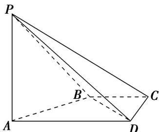

<!-- question-source:start -->
1. (2016·四川)如图，在四棱锥 P-ABCD 中， $PA \perp CD$ ， $AD \parallel BC$ ， $\angle ADC = \angle PAB = 90^{\circ}$ ， $BC = CD = \frac{1}{2}AD$ .

(1)在平面 PAD 内找一点 M，使得直线 $CM \parallel$ 平面 PAB，并说明理由；

(2)证明：平面 $PAB \perp$ 平面 $PBD$ .

<!-- question-source:end -->

![[高中/总复习/专题/立体几何/专题09 立体几何中的探索性问题-立体几何（文科）/考点01_探究平行问题/对点训练/answers/Q00043622A1.md]]
