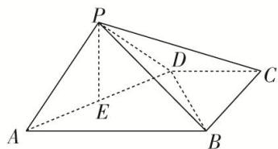

<!-- question-source:start -->
2. 如图，在四棱锥 $P - ABCD$ 中，底面 $ABCD$ 为梯形， $AB \parallel CD$ ， $AB \perp BC$ ， $AB = 2$ ， $PA = PD = CD = BC = 1$ ，面 $PAD \perp$ 面 $ABCD$ ， $E$ 为 $AD$ 的中点.

(1)求证： $PA \perp BD;$

(2)在线段 $AB$ 上是否存在一点 $G$ , 使得 $BC \parallel$ 面 $PEG$ ? 若存在, 请证明你的结论; 若不存在, 请说明理由.

<!-- question-source:end -->

![[高中/总复习/专题/立体几何/专题09 立体几何中的探索性问题-立体几何（文科）/考点01_探究平行问题/对点训练/answers/Q00043623A1.md]]
