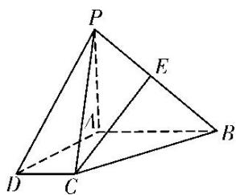

<!-- question-source:start -->
8. 如图，在四棱锥 $P - ABCD$ 中， $AB \parallel CD$ ， $AB = 2CD$ ， $E$ 为 $PB$ 的中点.

(1)求证： $CE \parallel$ 平面 PAD;

(2)在线段 $AB$ 上是否存在一点 $F$ , 使得平面 $PAD \parallel$ 平面 $CEF$ ? 若存在, 证明你的结论, 若不存在, 请说明理由.

<!-- question-source:end -->

![[高中/总复习/专题/立体几何/专题09 立体几何中的探索性问题-立体几何（文科）/考点01_探究平行问题/对点训练/answers/Q00043629A1.md]]
