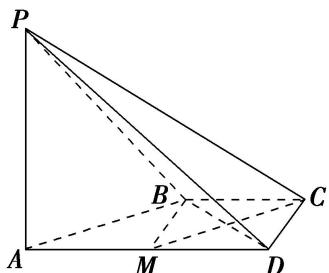

> [!faq]- 《专题09 立体几何中的探索性问题-立体几何（文科）》例题解析
>
> > [!success]- **【答案】** 详见解析
>
> > [!note]- **【分析】**
> > 本题未单列分析。
>
> > [!note]- **【解析】**
> > (1)在平面 PAD 内找一点 M，使得直线 $CM \parallel$ 平面 PAB，并说明理由；
> > (2)证明：平面 $PAB \perp$ 平面 $PBD$ .
> > 
> > 1. 解析 (1)取棱 $AD$ 的中点 $M(M \in$ 平面 $PAD)$ ，点 $M$ 即为所求的一个点。理由如下：因为 $AD \parallel BC$ ， $BC = \frac{1}{2} AD$ ，所以 $BC \parallel AM$ ，且 $BC = AM$ ，所以四边形 $AMCB$ 是平行四边形，从而 $CM \parallel AB$ 。又 $AB \subset$ 平面 $PAB$ ， $CM \not\subset$ 平面 $PAB$ ，所以 $CM \parallel$ 平面 $PAB$ 。
> > (说明：取棱 $PD$ 的中点 $N$ ，则所找的点可以是直线 $MN$ 上任意一点)
> > 
> > (2)由已知， $PA \perp AB$ ， $PA \perp CD$ ，因为 $AD \parallel BC$ ， $BC = \frac{1}{2} AD$ ，所以直线 AB 与 CD 相交。
> > 所以 $PA \perp$ 平面 ABCD，从而 $PA \perp BD$ ．连接 BM，因为 $AD \parallel BC$ ， $BC = \frac{1}{2} AD$ ，
> > 所以 $BC \parallel MD$ ，且 BC = MD。所以四边形 BCDM 是平行四边形。
> > 所以 $BM = CD = \frac{1}{2} AD$ ，所以 $BD \perp AB$ 。又 $AB \cap AP = A$ ，所以 $BD \perp$ 平面 PAB。又 $BD \subset$ 平面 PBD，所以平面 $PAB \perp$ 平面 PBD。
