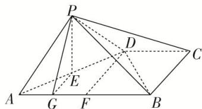

> [!faq]- 《专题09 立体几何中的探索性问题-立体几何（文科）》例题解析
>
> > [!success]- **【答案】** 详见解析
>
> > [!note]- **【分析】**
> > 本题未单列分析。
>
> > [!note]- **【解析】**
> > (1)求证： $PA \perp BD;$
> > (2)在线段 $AB$ 上是否存在一点 $G$ , 使得 $BC \parallel$ 面 $PEG$ ? 若存在, 请证明你的结论; 若不存在, 请说明理由.
> > 
> > 2. 解析 (1)取 $AB$ 的中点 $F$ , 连接 $DF$ . $\because DC \parallel AB$ 且 $DC = \frac{1}{2} AB$ , $\therefore DC \parallel BF$ 且 $DC = BF$ , $\therefore$ 四边形 $BCDF$ 为平行四边形, 又 $AB \perp BC$ , $BC = CD = 1$ , $\therefore$ 四边形 $BCDF$ 为正方形. 在 Rt△AFD 中, $\because DF = AF = 1$ , $\therefore AD = \sqrt{2}$ , 在 Rt△BCD 中, $\because BC = CD = 1$ , $\therefore BD = \sqrt{2}$ , $\because AB = 2$ , $\therefore AD^2 + BD^2 = AB^2$ , $\therefore BD \perp AD$ , $\because BD \subset$ 面 $ABCD$ , 面 $PAD \cap$ 面 $ABCD = AD$ , 面 $PAD \perp$ 面 $ABCD$ , $\therefore BD \perp$ 面 $PAD$ , $\because PA \subset$ 面 $PAD$ , $\therefore PA \perp BD$ .
> > 
> > (2)在线段 AB 上存在一点 G，满足 $AG=\frac{1}{4}AB$ ，即 G 为 AF 的中点时，BC // 面 PEG，证明如下：
> > 连接 EG，∵ E 为 AD 的中点，G 为 AF 中点，∴ GE // DF，
> > $DF//BC, \therefore GE//BC, \because GE \subset \text{面} PEG, BC \notin \text{面} PEG, \therefore BC // \text{面} PEG.$
