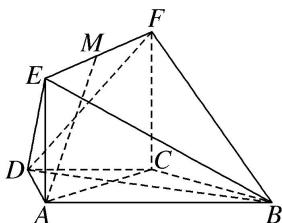
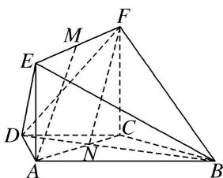

> [!faq]- 《专题09 立体几何中的探索性问题-立体几何（文科）》例题解析
>
> > [!success]- **【答案】** 详见解析
>
> > [!note]- **【分析】**
> > 本题未单列分析。
>
> > [!note]- **【解析】**
> > (1)求证： $BC \perp$ 平面 ACFE;
> > (2)当 EM 为何值时，AM// 平面 BDF？证明你的结论.
> > 
> > 10. 解析 (1)证明：在梯形 $ABCD$ 中，因为 $AB \parallel CD$ ， $AD = DC = CB = a$ ， $\angle ABC = 60^\circ$ 所以四边形 $ABCD$ 是等腰梯形，且 $\angle DCA = \angle DAC = 30^\circ$ ， $\angle DCB = 120^\circ$ 所以 $\angle ACB = \angle DCB - \angle DCA = 90^\circ$ ，所以 $AC \perp BC$
> > 又平面 $ACFE \perp$ 平面 ABCD，平面 $ACFE \cap$ 平面 ABCD = AC， $BC \subset$ 平面 ABCD，所以 $BC \perp$ 平面 ACFE.
> > 
> > (2)当 $EM=\frac{\sqrt{3}}{3}a$ 时，AM// 平面 BDF，理由如下：
> > 如图，在梯形 ABCD 中，设 $AC \cap BD = N$ ，连接 FN.
> > 由(1)知四边形 ABCD 为等腰梯形，且 $\angle ABC = 60^{\circ}$ ，所以 AB = 2DC，则 CN : NA = 1 : 2.
> > 易知 $EF = AC = \sqrt{3}a$ ，所以 $AN = \frac{2\sqrt{3}}{3}a$ 。因为 $EM = \frac{\sqrt{3}}{3}a$ ，所以 $MF = \frac{2}{3}EF = \frac{2\sqrt{3}}{3}a$ ，所以 MF 練 AN，
> > 所以四边形 ANFM 是平行四边形，所以 AM//NF，又 NF⊂平面 BDF，AM∉平面 BDF，
> > 所以 AM// 平面 BDF.
