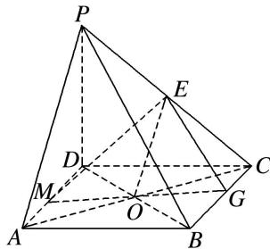

> [!faq]- 《专题09 立体几何中的探索性问题-立体几何（文科）》例题解析
>
> > [!success]- **【答案】** 详见解析
>
> > [!note]- **【解析】**
> > 解析
> > (1) 因为 $PD \perp$ 平面 $ABCD$ , $BC \subset$ 平面 $ABCD$ , 所以 $PD \perp BC$ . 因为四边形 $ABCD$ 是正方形, 所以 $BC \perp CD$ .
> >
> > 又 $PD \cap CD = D$ ，PD， $CD \subset$ 平面 PCD，所以 $BC \perp$ 平面 PCD.
> >
> > 因为 $PC \subset$ 平面 PDC，所以 $PC \perp BC$ .
> >
> > 
> >
> > (2)连接 AC, BD 交于点 O, 连接 EO, GO, 延长 GO 交 AD 于点 M, 连接 EM, 则 PA // 平面 MEG. 证明如下: 因为 E 为 PC 的中点, O 是 AC 的中点, 所以 EO // PA.
> >
> > 因为 $EO \subset$ 平面 MEG， $PA \not\subset$ 平面 MEG，所以 $PA \parallel$ 平面 MEG。因为 $\triangle OCG \cong \triangle OAM$ ，
> >
> > 所以 $AM = CG = \frac{2}{3}$ ，所以 $AM$ 的长为 $\frac{2}{3}$ .
