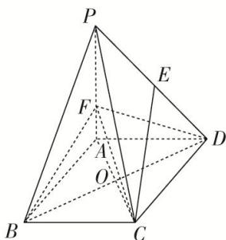
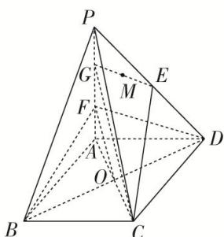

> [!faq]- 《专题09 立体几何中的探索性问题-立体几何（文科）》例题解析
>
> > [!success]- **【答案】** 详见解析
>
> > [!note]- **【分析】**
> > 本题未单列分析。
>
> > [!note]- **【解析】**
> > (1)求证：平面 $BDF \perp$ 平面 $ACF$ ;
> > (2)若 $AF = 2$ ，侧面PAD内是否存在过点 $E$ 的一条直线，使得直线上任一点 $M$ 都有 $CM / /$ 平面BDF，若存在，给出证明；若不存在，请说明理由.
> > 
> > 4. 解析
> > (1)由题意可知, $PA \perp$ 平面 $ABCD$ , 则 $BD \perp PA$ , 又底面 $ABCD$ 是菱形,
> > 所以 $BD \perp AC$ ，PA，AC 为平面 PAC 内两相交直线，
> > 所以 $BD \perp$ 平面 PAC，BD 为平面 BDF 内一直线，从而平面 $BDF \perp$ 平面 ACF.
> > (2)侧面 PAD 内存在过点 E 的一条直线，使得直线上任一点 M 都有 CM// 平面 BDF.
> > 
> > 设 $G$ 是 $PF$ 的中点，连接 $EG, CG, OF$ ，则 $\left\{ \begin{array}{l} EG // FD, \\ CG // OF \end{array} \right. \Rightarrow$ 平面 $CEG //$ 平面 $BDF$ ，所以直线 $EG$ 上任一点 $M$ 都满足 $CM //$ 平面 $BDF$ .
