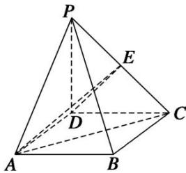
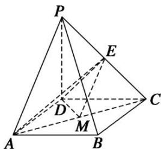

> [!faq]- 《专题09 立体几何中的探索性问题-立体几何（文科）》例题解析
>
> > [!success]- **【答案】** 详见解析
>
> > [!note]- **【分析】**
> > 本题未单列分析。
>
> > [!note]- **【解析】**
> > (1)求三棱锥 A—PDE 的体积;
> >
> > (2) $AC$ 边上是否存在一点 $M$ , 使得 $PA \parallel$ 平面 $EDM$ ? 若存在, 求出 $AM$ 的长; 若不存在, 请说明理由.
> >
> > 
> >
> > 5. 解析
> > (1) 因为 $PD \perp$ 平面 $ABCD$ , 所以 $PD \perp AD$ . 又因 $ABCD$ 是矩形, 所以 $AD \perp CD$ . 因 $PD \cap CD = D$ , 所以 $AD \perp$ 平面 $PCD$ , 所以 $AD$ 是三棱锥 $A—PDE$ 的高.
> >
> > 因为 E 为 PC 的中点，且 PD=DC=4，所以 $S_{\triangle PDE}=\frac{1}{2}S_{\triangle PDC}=\frac{1}{2}\times\left(\frac{1}{2}\times4\times4\right)=4$ .
> >
> > 又 AD=2，所以 $V_{A-PDE}=\frac{1}{3}AD\cdot S_{\triangle PDE}=\frac{1}{3}\times2\times4=\frac{8}{3}.$
> >
> > 
> >
> > (2)取 AC 中点 M，连接 EM，DM，因为 E 为 PC 的中点，M 是 AC 的中点，所以 EM // PA. 又因为 EM ⊂ 平面 EDM，PA ∉ 平面 EDM，所以 PA // 平面 EDM.
> >
> > 所以 $AM=\frac{1}{2}AC=\sqrt{5}$ . 即在 AC 边上存在一点 M，使得 PA // 平面 EDM，AM 的长为 $\sqrt{5}$ .
