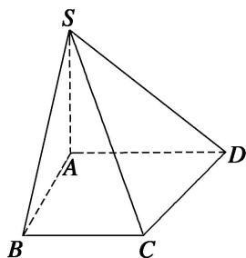
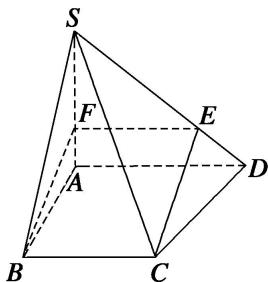

> [!faq]- 《专题09 立体几何中的探索性问题-立体几何（文科）》例题解析
>
> > [!success]- **【答案】** 详见解析
>
> > [!note]- **【分析】**
> > 本题未单列分析。
>
> > [!note]- **【解析】**
> > (1)求四棱锥 S-ABCD 的体积;
> > (2)在棱 $SD$ 上找一点 $E$ , 使 $CE \parallel$ 平面 $SAB$ , 并证明.
> > 
> > 6. 解析
> > (1)∵SA⊥底面ABCD， $\tan\angle SDA=\frac{2}{3}$ ，SA=2，∴AD=3.
> > 由题意知四棱锥 S-ABCD 的底面为直角梯形，且 SA=AB=BC=2，
> > $$
> > V _ {S - A B C D} = \frac {1}{3} \times S A \times \frac {1}{2} \times (B C + A D) \times A B = \frac {1}{3} \times 2 \times \frac {1}{2} \times (2 + 3) \times 2 = \frac {1 0}{3}.
> > $$
> > 
> > (2)当点 E 位于棱 SD 上靠近 D 的三等分点处时，可使 CE // 平面 SAB.
> > 取 SD 上靠近 D 的三等分点为 E，取 SA 上靠近 A 的三等分点为 F，连接 CE，EF，BF，
> > 则 $EF \underline{\underline{\underline{\underline{\underline{2}}}}} \frac{2}{3} AD, BC \underline{\underline{\underline{\underline{2}}}} \frac{2}{3} AD, \therefore BC \underline{\underline{\underline{2}} EF}, \therefore CE \parallel BF.$
> > 又∵BF⊂平面SAB，CE≠平面SAB，∴CE∥平面SAB.
