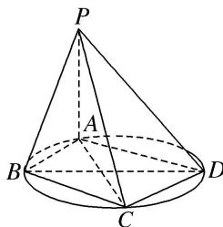

> [!faq]- 《专题09 立体几何中的探索性问题-立体几何（文科）》例题解析
>
> > [!success]- **【答案】** 详见解析
>
> > [!note]- **【分析】**
> > 本题未单列分析。
>
> > [!note]- **【解析】**
> > (1)当 $BD$ 是圆 $W$ 的直径时， $PA = BD = 2$ ， $AD = CD = \sqrt{3}$ ，求四棱锥 $P - ABCD$ 的体积.
> >
> > (2)在
> > (1)的条件下，判断在棱 $PA$ 上是否存在一点 $Q$ ，使得 $BQ \parallel$ 平面 $PCD$ ？若存在，求出 $AQ$ 的长；若不存在，请说明理由.
> >
> > 
> >
> > 7. 解析
> > (1) 因为 $BD$ 是圆 $W$ 的直径, 所以 $BA \perp AD$ , 因为 $BD = 2$ , $AD = \sqrt{3}$ , 所以 $AB = 1$ . 同理 $BC = 1$ , 所以 $S_{\text{四边形}ABCD} = AB \cdot AD = \sqrt{3}$ .
> >
> > 因为 $PA \perp$ 平面 ABCD，PA = 2，所以四棱锥 P-ABCD 的体积 $V = \frac{1}{3} S_{四边形 ABCD} \cdot PA = \frac{2\sqrt{3}}{3}$ .
> >
> > (2)存在， $AQ=\frac{2}{3}$ . 理由如下.
> >
> > 延长 AB, DC 交于点 E，连接 PE，则平面 PAB 与平面 PCD 的交线是 PE.
> >
> > 假设在棱 PA 上存在一点 Q，使得 BQ // 平面 PCD，则 BQ // PE，所以 $\frac{AQ}{PA} = \frac{AB}{AE}$ .
> >
> > 经计算可得 BE=2，所以 $AE=AB+BE=3$ ，所以 $AQ=\frac{2}{3}$ .
> >
> > 故存在这样的点 Q，使 BQ // 平面 PCD，且 $AQ=\frac{2}{3}$ .
