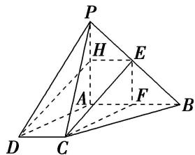
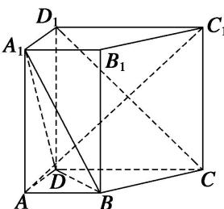
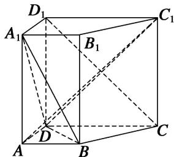
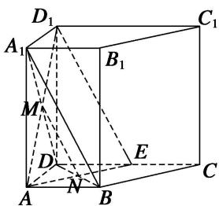

> [!faq]- 《专题09 立体几何中的探索性问题-立体几何（文科）》例题解析
>
> > [!success]- **【答案】** E
>
> > [!note]- **【解析】**
> > 解析
> > (1)证明: 取 $PA$ 的中点 $H$ , 连接 $EH, DH$ . 因为 $E$ 为 $PB$ 的中点, 所以 $EH \parallel AB$ , $EH = \frac{1}{2} AB$ , 又 $AB \parallel CD$ , $CD = \frac{1}{2} AB$ , 所以 $EH \parallel CD$ , $EH = CD$ , 因此四边形 $DCEH$ 是平行四边形, 所以 $CE \parallel DH$ , 又 $DH \subset$ 平面 $PAD$ , $CE \nmid$ 平面 $PAD$ , 故 $CE \parallel$ 平面 $PAD$ .
> >
> > 
> >
> > (2)存在点 $F$ 为 $AB$ 的中点，使平面 $PAD \parallel$ 平面 $CEF$ 。证明如下：
> >
> > 取 $AB$ 的中点 $F$ ，连接 $CF$ ， $EF$ ，所以 $AF = \frac{1}{2} AB$ ，又 $CD = \frac{1}{2} AB$ ，所以 $AF = CD$
> >
> > 又 $AF \parallel CD$ ，所以四边形 $AFCD$ 为平行四边形，因此 $CF \parallel AD$ ，又 $CF \nparallel$ 平面 $PAD$ ，所以 $CF \parallel$ 平面 $PAD$ ，由
> > (1)可知 $CE \parallel$ 平面 $PAD$ ，又 $CE \cap CF = C$ ，故平面 $CEF \parallel$ 平面 $PAD$ ，故存在 $AB$ 的中点 $F$ 满足要求。如图，在直四棱柱 $ABCD - A_1B_1C_1D_1$ 中，已知 $DC = DD_1 = 2AD = 2AB$ ， $AD \perp DC$ ， $AB \parallel DC$ 。
> >
> > (1)求证： $D_{1}C\bot AC_{1}$
> >
> > (2)问在棱 $CD$ 上是否存在点 $E$ , 使 $D_{1}E \parallel$ 平面 $A_{1}BD$ . 若存在, 确定点 $E$ 位置; 若不存在, 说明理由.
> >
> > 
> >
> > 9. 解析
> > (1)在直四棱柱 $ABCD - A_{1}B_{1}C_{1}D_{1}$ 中，连接 $C_{1}D$ ， $\because DC = DD_{1}$ ， $\therefore$ 四边形 $DCC_{1}D_{1}$ 是正方形， $\therefore DC_{1} \perp D_{1}C$ 。又 $AD \perp DC$ ， $AD \perp DD_{1}$ ， $DC \cap DD_{1} = D$ ， $\therefore AD \perp$ 平面 $DCC_{1}D_{1}$ ，又 $D_{1}C \subset$ 平面 $DCC_{1}D_{1}$ ， $\therefore AD \perp D_{1}C$ 。 $\because AD \subset$ 平面 $ADC_{1}$ ， $DC_{1} \subset$ 平面 $ADC_{1}$ ，且 $AD \cap DC_{1} = D$ ， $\therefore D_{1}C \perp$ 平面 $ADC_{1}$ ，又 $AC_{1} \subset$ 平面 $ADC_{1}$ ， $\therefore D_{1}C \perp AC_{1}$ 。
> >
> > 
> >
> > 
> >
> > (2)假设存在点 E，使 $D_{1}E \parallel$ 平面 $A_{1}BD$ 。连接 $AD_{1}$ ，AE， $D_{1}E$ ，设 $AD_{1} \cap A_{1}D = M$ ，
> >
> > $BD \cap AE = N$ ，连接 MN，∵平面 $AD_{1}E \cap$ 平面 $A_{1}BD = MN$ ，要使 $D_{1}E \parallel$ 平面 $A_{1}BD$ ，可使 $MN \parallel D_{1}E$ ，又 M 是 $AD_{1}$ 的中点，则 N 是 AE 的中点．又易知 $\triangle ABN \cong \triangle EDN$ ，∴ AB = DE．即 E 是 DC 的中点．综上所述，当 E 是 DC 的中点时，可使 $D_{1}E \parallel$ 平面 $A_{1}BD$ ．
