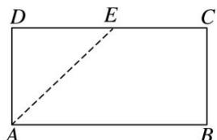
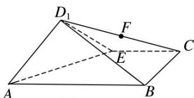

> [!faq]- 《专题09 立体几何中的探索性问题-立体几何（文科）》例题解析
>
> > [!success]- **【答案】** BE
>
> > [!note]- **【分析】**
> > 本题未单列分析。
>
> > [!note]- **【解析】**
> > (1)证明： $BE \perp$ 平面 $D_{1}AE$ ;
> >
> > (2)设 $F$ 为 $CD_{1}$ 的中点，在线段 $AB$ 上是否存在一点 $M$ ，使得 $MF \parallel$ 平面 $D_{1}AE$ ，若存在，求出 $\frac{AM}{AB}$ 的值；若不存在，请说明理由.
> >
> >   
> > 图1
> >
> >   
> > 图2
> >
> > 11. 解析
> > (1)连接 BE, ∵ABCD 为矩形且 AD=DE=EC=BC=2, ∴∠AEB=90°, 即 BE⊥AE, 又平面 D₁AE⊥平面 ABCE, 平面 D₁AE∩平面 ABCE=AE, BE⊂平面 ABCE, ∴BE⊥平面 D₁AE.
> >
> > (2) $AM=\frac{1}{4}AB$ , 取 D₁E 的中点 L, 连接 AL, FL, ∵FL∥EC, EC∥AB, ∴FL∥AB 且 FL= $\frac{1}{4}AB$ , ∴M, F, L, A 四点共面, 若 MF∥平面 AD₁E, 则 MF∥AL.
> >
> > ∴AMFL 为平行四边形，∴AM=FL= $\frac{1}{4}$ AB．故线段 AB 上存在满足题意的点 M，且 $\frac{AM}{AB}=\frac{1}{4}$ .
