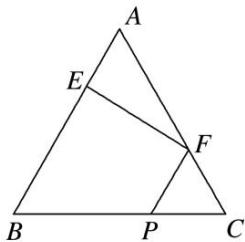
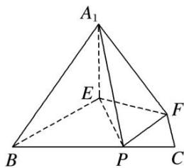
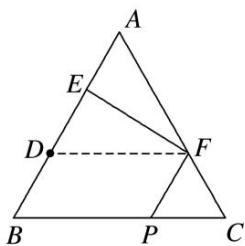
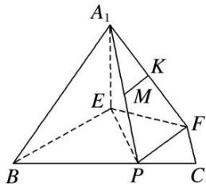

> [!faq]- 《专题09 立体几何中的探索性问题-立体几何（文科）》例题解析
>
> > [!success]- **【答案】** 详见解析
>
> > [!note]- **【分析】**
> > 本题未单列分析。
>
> > [!note]- **【解析】**
> > (1)，在正 $\triangle ABC$ 中， $E, F$ 分别是 $AB, AC$ 边上的点，且 $BE = AF = 2CF$ 。点 $P$ 为边 $BC$ 上的点，将 $\triangle AEF$ 沿 $EF$ 折起到 $\triangle A_{1}EF$ 的位置，使平面 $A_{1}EF \perp$ 平面 $BEFC$ ，连接 $A_{1}B, A_{1}P, EP$ ，如图
> > (2)所示。
> > (1)求证： $A_{1}E \perp FP$ ;
> > (2)若 $BP = BE$ ，点 $K$ 为棱 $A_{1}F$ 的中点，则在平面 $A_{1}FP$ 上是否存在过点 $K$ 的直线与平面 $A_{1}BE$ 平行，若存在，请给予证明；若不存在，请说明理由.
> > 
> > (1)
> > 
> > (2)
> > 12. 解析
> > (1)在正 $\triangle ABC$ 中, 取 $BE$ 的中点 $D$ , 连接 $DF$ , 如图所示.
> > 
> > 因为 $BE = AF = 2CF$ ，所以 $AF = AD$ ， $AE = DE$ ，而 $\angle A = 60^{\circ}$ ，所以△ADF为正三角形.又 $AE = DE$ ，所以 $EF\bot AD$ .所以在题图
> > (2)中， $A_{1}E\bot EF$ 又 $A_{1}E\subset$ 平面 $A_{1}EF$ ，平面 $A_{1}EF\bot$ 平面BEFC，且平面 $A_{1}EF\cap$ 平面BEFC=EF，所以 $A_{1}E\bot$ 平面BEFC．因为 $FP\subset$ 平面BEFC，所以 $A_{1}E\bot FP.$ (2)在平面 $A_{1}FP$ 上存在过点 $K$ 的直线与平面 $A_{1}BE$ 平行.理由如下：
> > 如题图
> > (1)，在正△ABC中，因为 BP=BE，BE=AF，所以 BP=AF，所以 FP//AB，所以 FP//BE.
> > 
> > 如图所示，取 $A_{1}P$ 的中点 $M$ ，连接 $MK$ ，因为点 $K$ 为棱 $A_{1}F$ 的中点，所以 $MK \parallel FP$ . 因为 $FP \parallel BE$ ，所以 $MK \parallel BE$ 。因为 $MK \nmid$ 平面 $A_{1}BE$ ， $BE \subset$ 平面 $A_{1}BE$ ，所以 $MK \parallel$ 平面 $A_{1}BE$ . 故在平面 $A_{1}FP$ 上存在过点 $K$ 的直线 $MK$ 与平面 $A_{1}BE$ 平行。
