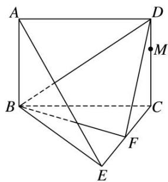
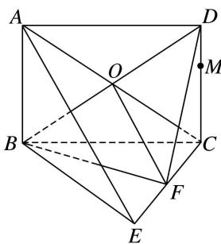
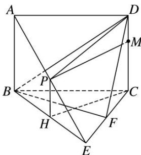

<!-- question-source:start -->
[例 1]如图所示，平面 $ABCD \perp$ 平面 BCE，四边形 ABCD 为矩形，BC = CE，点 F 为 CE 的中点.
(1)证明：AE//平面 BDF;

(2)点 $M$ 为 $CD$ 上任意一点，在线段 $AE$ 上是否存在点 $P$ ，使得 $PM \perp BE$ ？若存在，确定点 $P$ 的位置，并加以证明；若不存在，请说明理由。

(1) 连接 AC 交 BD 于点 O，连接 OF.

∵四边形 ABCD 是矩形，∴O 为 AC 的中点．又 F 为 EC 的中点，∴OF//AE.

又 $OF \subset$ 平面 BDF, $AE \not\subset$ 平面 BDF, $\therefore AE \parallel$ 平面 BDF.

(2)当点 P 为 AE 的中点时，有 $PM \perp BE$ ，证明如下：

取 BE 的中点 H，连接 DP，PH，CH. ∵ P 为 AE 的中点，H 为 BE 的中点，∴ PH // AB.

又 $AB \parallel CD$ ， $\therefore PH \parallel CD$ ， $\therefore P, H, C, D$ 四点共面.

∵平面 $ABCD \perp$ 平面 BCE，且平面 $ABCD \cap$ 平面 BCE = BC， $CD \perp BC$ ，

$CD \subset$ 平面 ABCD， $\therefore CD \perp$ 平面 BCE．又 $BE \subset$ 平面 BCE， $\therefore CD \perp BE$ ，

$\because BC=CE$ ，且 H 为 BE 的中点， $\therefore CH\perp BE$ .

又 $CH \cap CD = C$ ，且 CH， $CD \subset$ 平面 DPHC，∴ BE ⊥ 平面 DPHC.

又 $PM \subset$ 平面 DPHC，∴ $PM \perp BE$ .
<!-- question-source:end -->

![[高中/总复习/专题/立体几何/专题09 立体几何中的探索性问题-立体几何（文科）/考点02_探究垂直问题/例题/answers/Q00043633A1.md]]
