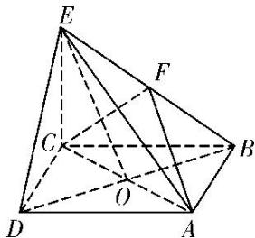

<!-- question-source:start -->
[例 2]在四棱锥 E-ABCD 中，底面 ABCD 是正方形，AC 与 BD 交于点 O，EC⊥底面 ABCD，点 F 为 BE 的中点.

(1)求证： $DE \parallel$ 平面 ACF;

(2)若 $AB = \sqrt{2} CE$ ，在线段 $EO$ 上是否存在点 $G$ ，使 $CG \perp$ 平面 $BDE$ ？若存在，求出 $\frac{EG}{EO}$ 的值；若不存在，请说明理由.

(1)证明：连接 $OF$ ，由四边形 $ABCD$ 是正方形可知点 $O$ 为 $BD$ 的中点。又 $F$ 为 $BE$ 的中点，所以 $OF \parallel DE$ 。又 $OF \subset$ 平面 $ACF$ ， $DE \nmid$ 平面 $ACF$ ，所以 $DE \parallel$ 平面 $ACF$ 。

(2)存在点 G，此时 $\frac{EG}{EO} = \frac{1}{2}$ . 证明如下：

若 $CG \perp$ 平面 BDE，则必有 $CG \perp OE$ ，于是作 $CG \perp OE$ 于点 G.

因为 $EC \perp$ 底面 ABCD，所以 $BD \perp EC$ ，又底面 ABCD 是正方形，所以 $BD \perp AC$ ，

又 $EC \cap AC = C$ ，所以 $BD \perp$ 平面 ACE。而 $CG \subset$ 平面 ACE，所以 $CG \perp BD$ 。

又 $OE \cap BD = O$ ，所以 $CG \perp$ 平面 $BDE$ 。又 $AB = \sqrt{2} CE$ ，所以 $CO = \frac{\sqrt{2}}{2} AB = CE$

所以点 G 为 EO 的中点，所以 $\frac{EG}{EO} = \frac{1}{2}$ .
<!-- question-source:end -->

![[高中/总复习/专题/立体几何/专题09 立体几何中的探索性问题-立体几何（文科）/考点02_探究垂直问题/例题/answers/Q00043634A1.md]]
