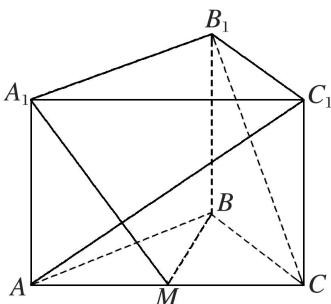
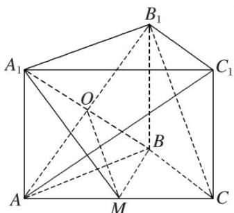
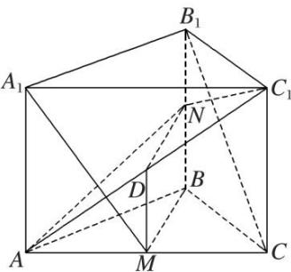

<!-- question-source:start -->
[例 4]如图，在三棱柱 $ABC-A_{1}B_{1}C_{1}$ 中，侧棱 $AA_{1}\perp$ 底面 ABC，M 为棱 AC 的中点．AB=BC，AC=2， $AA_{1}=\sqrt{2}$ .

(1)求证： $B_{1}C \parallel$ 平面 $A_{1}BM;$

(2)求证： $AC_{1} \perp$ 平面 $A_{1}BM$ ;

(3)在棱 $BB_{1}$ 上是否存在点 $N$ ，使得平面 $AC_{1}N \perp$ 平面 $AA_{1}C_{1}C$ ？如果存在，求此时 $\frac{BN}{BB_{1}}$ 的值；如果不存在，请说明理由.

(1)连接 $AB_{1}$ 与 $A_{1}B$ ，两线交于点 O，连接 OM.

在 $\triangle B_{1}AC$ 中， $\because M, O$ 分别为 $AC, AB_{1}$ 的中点， $\therefore OM \parallel B_{1}C,$

又∵OM⊂平面 $A_{1}BM$ ， $B_{1}C\not\subset$ 平面 $A_{1}BM$ ，∴ $B_{1}C//$ 平面 $A_{1}BM$ .

(2)∵侧棱 $AA_{1}$ ⊥ 底面 ABC, BM ⊂ 平面 ABC, ∴ $AA_{1}$ ⊥ BM,

又∵M为棱AC的中点，AB=BC，∴BM⊥AC.

$\because AA_{1}\cap AC=A,\ AA_{1},\ AC\subset\text{平面}ACC_{1}A_{1},\therefore BM\perp\text{平面}ACC_{1}A_{1},\therefore BM\perp AC_{1}.$

∵ AC=2，∴ AM=1．又∵ $AA_{1}=\sqrt{2}$ ，∴ 在 Rt△ACC₁ 和 Rt△A₁AM 中，

$$
\tan \angle A C _ {1} C = \tan \angle A _ {1} M A = \sqrt {2}, \therefore \angle A C _ {1} C = \angle A _ {1} M A
$$

即 $\angle AC_{1}C + \angle C_{1}AC = \angle A_{1}MA + \angle C_{1}AC = 90^{\circ}, \therefore A_{1}M \perp AC_{1}.$

$\because BM\cap A_{1}M=M,\ BM,\ A_{1}M\subset\text{平面 }A_{1}BM,\therefore AC_{1}\perp\text{ 平面 }A_{1}BM.$

(3)当点 N 为 $BB_{1}$ 的中点，即 $\frac{BN}{BB_{1}} = \frac{1}{2}$ 时，平面 $AC_{1}N \perp$ 平面 $AA_{1}C_{1}C$ .

证明如下：

设 $AC_{1}$ 的中点为 D，连接 DM，DN. ∵D，M 分别为 $AC_{1}$ ，AC 的中点，∴ $DM \parallel CC_{1}$ ，且 $DM = \frac{1}{2} CC_{1}$ . 又∵N 为 $BB_{1}$ 的中点，∴ DM // BN，且 DM = BN，∴ 四边形 BNDM 为平行四边形，∴ BM // DN，

∵BM⊥平面 $ACC_{1}A_{1}$ ，∴DN⊥平面 $AA_{1}C_{1}C$ 。又∵DN⊂平面 $AC_{1}N$ ，∴平面 $AC_{1}N \perp$ 平面 $AA_{1}C_{1}C$ 。

## 【对点训练】
<!-- question-source:end -->

![[高中/总复习/专题/立体几何/专题09 立体几何中的探索性问题-立体几何（文科）/考点02_探究垂直问题/例题/answers/Q00043636A1.md]]
