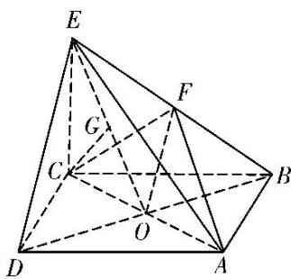

> [!faq]- 《专题09 立体几何中的探索性问题-立体几何（文科）》例题解析
>
> > [!success]- **【答案】** B
>
> > [!note]- **【解析】**
> > 解析
> > (1)证明：连接 $OF$ ，由四边形 $ABCD$ 是正方形可知点 $O$ 为 $BD$ 的中点。又 $F$ 为 $BE$ 的中点，所以 $OF \parallel DE$ 。又 $OF \subset$ 平面 $ACF$ ， $DE \nmid$ 平面 $ACF$ ，所以 $DE \parallel$ 平面 $ACF$ 。
> >
> > 
> >
> > (2)存在点 G，此时 $\frac{EG}{EO} = \frac{1}{2}$ . 证明如下：
> >
> > 若 $CG \perp$ 平面 BDE，则必有 $CG \perp OE$ ，于是作 $CG \perp OE$ 于点 G.
> >
> > 因为 $EC \perp$ 底面 ABCD，所以 $BD \perp EC$ ，又底面 ABCD 是正方形，所以 $BD \perp AC$ ，
> >
> > 又 $EC \cap AC = C$ ，所以 $BD \perp$ 平面 ACE。而 $CG \subset$ 平面 ACE，所以 $CG \perp BD$ 。
> >
> > 又 $OE \cap BD = O$ ，所以 $CG \perp$ 平面 $BDE$ 。又 $AB = \sqrt{2} CE$ ，所以 $CO = \frac{\sqrt{2}}{2} AB = CE$
> >
> > 所以点 G 为 EO 的中点，所以 $\frac{EG}{EO} = \frac{1}{2}$ .
