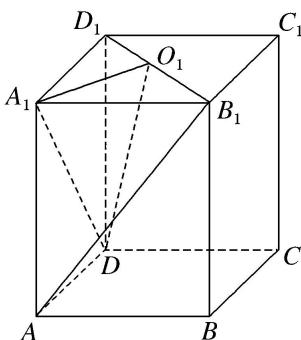

<!-- question-source:start -->
2. 如图所示，已知长方体 $ABCD-A_{1}B_{1}C_{1}D_{1}$ ，点 $O_{1}$ 为 $B_{1}D_{1}$ 的中点.

(1)求证： $AB_{1} \parallel$ 平面 $A_{1}O_{1}D$ ;

(2)若 $AB = \frac{2}{3} AA_{1}$ ，在线段 $BB_{1}$ 上是否存在点 $E$ 使得 $A_{1}C \perp AE$ ？若存在，求出 $\frac{BE}{BB_{1}}$ ；若不存在，说明理由.

<!-- question-source:end -->

![[高中/总复习/专题/立体几何/专题09 立体几何中的探索性问题-立体几何（文科）/考点02_探究垂直问题/对点训练/answers/Q00043638A1.md]]
