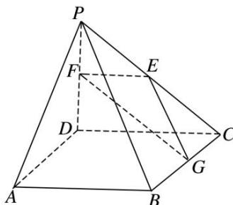

<!-- question-source:start -->
4. 如图，在四棱锥 $P - ABCD$ 中， $ABCD$ 是正方形， $PD \perp$ 平面 $ABCD$ . $PD = AB = 2, E, F, G$ 分别是 $PC, PD, BC$ 的中点.

(1)求证：平面 $PAB \parallel$ 平面 $EFG$ ;

(2)在线段 PB 上确定一点 Q，使 $PC \perp$ 平面 ADQ，并给出证明.

<!-- question-source:end -->

![[高中/总复习/专题/立体几何/专题09 立体几何中的探索性问题-立体几何（文科）/考点02_探究垂直问题/对点训练/answers/Q00043640A1.md]]
