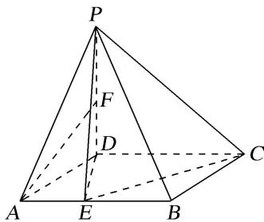

<!-- question-source:start -->
5. 如图，在四棱锥 P-ABCD 中，底面 ABCD 是菱形， $\angle DAB=30^{\circ}$ ， $PD\perp$ 平面 ABCD，AD=2，点 E 为

$AB$ 上一点，且 $\frac{AE}{AB} = m$ ，点 $F$ 为 $PD$ 中点.

(1)若 $m = \frac{1}{2}$ ，证明：直线 $AF / /$ 平面 $PEC$ ；

(2)是否存在一个常数 $m$ ，使得平面 $PED \perp$ 平面 $PAB$ ？若存在，求出 $m$ 的值；若不存在，说明理由.

<!-- question-source:end -->

![[高中/总复习/专题/立体几何/专题09 立体几何中的探索性问题-立体几何（文科）/考点02_探究垂直问题/对点训练/answers/Q00043641A1.md]]
