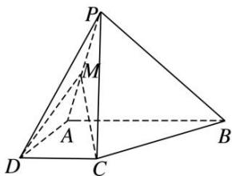

<!-- question-source:start -->
8. 如图, 在四棱锥 $P - ABCD$ 中, $PC = AD = CD = \frac{1}{2} AB = 2$ , $AB // DC$ , $AD \perp CD$ , $PC \perp$ 平面 $ABCD$ .

(1)求证： $BC \perp$ 平面 PAC;

(2)若 $M$ 为线段 $PA$ 的中点，且过 $C, D, M$ 三点的平面与线段 $PB$ 交于点 $N$ ，确定点 $N$ 的位置，说明理由；并求三棱锥 $A—CMN$ 的高.

<!-- question-source:end -->

![[高中/总复习/专题/立体几何/专题09 立体几何中的探索性问题-立体几何（文科）/考点02_探究垂直问题/对点训练/answers/Q00043644A1.md]]
