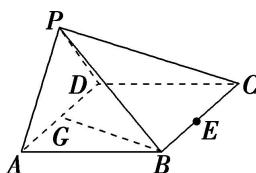
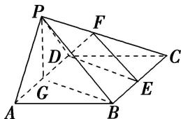

> [!faq]- 《专题09 立体几何中的探索性问题-立体几何（文科）》例题解析
>
> > [!success]- **【答案】** 详见解析
>
> > [!note]- **【分析】**
> > 本题未单列分析。
>
> > [!note]- **【解析】**
> > (1)求证： $BG \perp$ 平面 PAD;
> > (2)求证： $AD \perp PB;$
> > (3)若 $E$ 为 $BC$ 边的中点，能否在棱 $PC$ 上找到一点 $F$ ，使平面 $DEF \perp$ 平面 $ABCD$ ？并证明你的结论.
> > 
> > 6. 解析 (1)在菱形 ABCD 中， $\angle DAB=60^{\circ}$ ，G 为 AD 的中点，所以 $BG\perp AD$ .
> > 又平面 $PAD \perp$ 平面 ABCD，平面 $PAD \cap$ 平面 ABCD = AD，所以 $BG \perp$ 平面 PAD.
> > 
> > (2)如图，连接 PG．因为 $\triangle PAD$ 为正三角形，G 为 AD 的中点，所以 $PG \perp AD$ .
> > 由(1)知， $BG \perp AD$ ，又 $PG \cap BG = G$ ，所以 $AD \perp$ 平面 PGB。因为 $PB \subset$ 平面 PGB，所以 $AD \perp PB$ 。
> > (3)当 F 为 PC 的中点时，满足平面 $DEF \perp$ 平面 ABCD.
> > 证明如下：取 $PC$ 的中点 $F$ ，连接 $DE$ 、 $EF$ 、 $DF$ .
> > 在 $\triangle PBC$ 中， $FE \parallel PB$ ，在菱形 $ABCD$ 中， $GB \parallel DE$ .
> > 而 $FE \subset$ 平面 DEF， $DE \subset$ 平面 DEF， $EF \cap DE = E$ ， $PB \subset$ 平面 PGB， $GB \subset$ 平面 PGB， $PB \cap GB = B$ ，
> > 所以平面 $DEF \parallel$ 平面 $PGB$ . 因为 $BG \perp$ 平面 $PAD$ , $PG \subset$ 平面 $PAD$ , 所以 $BG \perp PG$ ,
> > 又因为 $PG \perp AD$ ， $AD \cap BG = G$ ，所以 $PG \perp$ 平面 ABCD.
> > 又 $PG \subset$ 平面 PGB，所以平面 $PGB \perp$ 平面 ABCD，所以平面 $DEF \perp$ 平面 ABCD.
