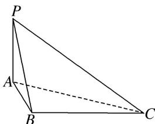
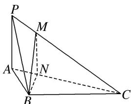

> [!faq]- 《专题09 立体几何中的探索性问题-立体几何（文科）》例题解析
>
> > [!success]- **【答案】** 详见解析
>
> > [!note]- **【分析】**
> > 本题未单列分析。
>
> > [!note]- **【解析】**
> > (1)求三棱锥 P-ABC 的体积;
> > (2)在线段 $PC$ 上是否存在点 $M$ , 使得 $AC \perp BM$ , 若存在, 请说明理由, 并求 $\frac{PM}{MC}$ 的值.
> > 
> > 1. 解析
> > (1)由题设 $AB = 1$ ， $AC = 2$ ， $\angle BAC = 60^{\circ}$ ，可得 $S_{\triangle ABC} = \frac{1}{2}\cdot AB\cdot AC\cdot \sin 60^{\circ} = \frac{\sqrt{3}}{2}$ 由 $PA\bot$ 平面 $ABC$ ，可知 $PA$ 是三棱锥 $P - ABC$ 的高，又 $PA = 1$ 所以三棱锥 $P - ABC$ 的体积 $V = \frac{1}{3}\cdot S_{\triangle ABC}\cdot PA = \frac{\sqrt{3}}{6}$
> > (2)在线段 $PC$ 上存在点 $M$ , 使得 $AC \perp BM$ , 证明如下:
> > 
> > 如图，在平面 ABC 内，过点 B 作 $BN \perp AC$ ，垂足为 N。在平面 PAC 内，
> > 过点 N 作 MN//PA 交 PC 于点 M，连接 BM．由 PA⊥平面 ABC，知 PA⊥AC，所以 MN⊥AC．因为 BN∩MN=N，所以 AC⊥平面 MBN，又 BM⊂平面 MBN，所以 AC⊥BM．
> > 在 Rt△BAN 中， $AN=AB\cdot\cos\angle BAC=\frac{1}{2}$ ，从而 NC=AC-AN= $\frac{3}{2}$ ，由 $MN\parallel PA$ ，得 $\frac{PM}{MC}=\frac{AN}{NC}=\frac{1}{3}$ .
