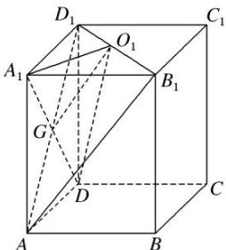
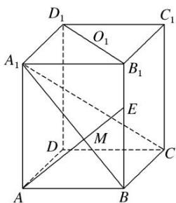

> [!faq]- 《专题09 立体几何中的探索性问题-立体几何（文科）》例题解析
>
> > [!success]- **【答案】** C
>
> > [!note]- **【解析】**
> > 解析
> > (1)证明：如图 1 所示，连接 $AD_{1}$ 交 $A_{1}D$ 于点 $G$ ， $\therefore G$ 为 $AD_{1}$ 的中点，连接 $O_{1}G$ ，在 $\triangle AB_{1}D_{1}$ 中， $\because O_{1}$ 为 $B_{1}D_{1}$ 的中点， $\therefore O_{1}G \parallel AB_{1}$ ， $\because O_{1}G \subset$ 平面 $A_{1}O_{1}D$ ，且 $AB_{1} \not\subset$ 平面 $A_{1}O_{1}D$ ， $\therefore AB_{1} \parallel$ 平面 $A_{1}O_{1}D$ .
> >
> >   
> > 图1
> >
> >   
> > 图2
> >
> > (2)若在线段 $BB_{1}$ 上存在点 $E$ 使得 $A_{1}C \perp AE$ ，连接 $A_{1}B$ 交 $AE$ 于点 $M$ ，如图2所示. $\because BC \perp$ 平面 $ABB_{1}A_{1}$ ， $AE \subset$ 平面 $ABB_{1}A_{1}$ ， $\therefore BC \perp AE$ .
> >
> > 又 $\because A_{1}C \cap BC = C$ ，且 $A_{1}C$ ， $BC \subset$ 平面 $A_{1}BC$ ， $\therefore AE \perp$ 平面 $A_{1}BC$ . $\because A_{1}B \subset$ 平面 $A_{1}BC$ ， $\therefore AE \perp A_{1}B$ .
> >
> > 在 $\triangle AMB$ 和 $\triangle ABE$ 中， $\angle BAM + \angle ABM = 90^{\circ}$ ， $\angle BAM + \angle BEA = 90^{\circ}$ ， $\therefore \angle ABM = \angle BEA$ . $\therefore Rt\triangle ABE \sim Rt\triangle A_{1}AB$ ， $\therefore \frac{BE}{AB} = \frac{AB}{AA_{1}}$ . $\because AB = \frac{2}{3} AA_{1}$ ， $\therefore BE = \frac{2}{3} AB = \frac{4}{9} BB_{1}$ ，即在线段 $BB_{1}$ 上存在点 $E$ 使得 $A_{1}C \perp AE$ ，此时 $\frac{BE}{BB_{1}} = \frac{4}{9}$ .
