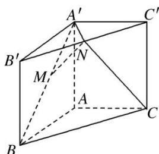
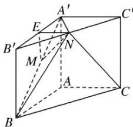

> [!faq]- 《专题09 立体几何中的探索性问题-立体几何（文科）》例题解析
>
> > [!success]- **【答案】** 详见解析
>
> > [!note]- **【分析】**
> > 本题未单列分析。
>
> > [!note]- **【解析】**
> > (1)证明： $MN \parallel$ 平面 $AA'C'C$ ;
> > (2)设 $AB=\lambda AA'$ ，当 $\lambda$ 为何值时， $CN\perp$ 平面 $A'MN$ ，试证明你的结论.
> > 
> > 3. 解析
> > (1)如图, 取 $A'B'$ 的中点 $E$ , 连接 $ME, NE$ .
> > 因为 M, N 分别为 $A'B$ 和 $B'C'$ 的中点, 所以 $NE \parallel A'C', ME \parallel AA'$ , 又 $A'C' \subset$ 平面 $AA'C'C', A'A \subset$ 平面 $AA'C'C'$ ,所以 $ME \parallel$ 平面 $AA'C'C$ , $NE \parallel$ 平面 $AA'C'C$ , 所以平面 $MNE \parallel$ 平面 $AA'C'C$ , 因为 $MN \subset$ 平面 $MNE$ , 所以 $MN \parallel$ 平面 $AA'C'C$ .
> > 
> > (2)连接 BN，设 $AA' = a$ ，则 $AB = \lambda AA' = \lambda a$ ，由题意知 $BC = \sqrt{2}\lambda a$ ， $CN = BN = \sqrt{a^{2} + \frac{1}{2}\lambda^{2}a^{2}}$
> > 因为三棱柱 $ABC-A'B'C'$ 的侧棱垂直于底面，所以平面 $A'B'C'\perp$ 平面 $BB'C'C$ ，
> > 因为 AB=AC，点 N 是 $B^{\prime}C^{\prime}$ 的中点，所以 $A^{\prime}B^{\prime}=A^{\prime}C^{\prime}$ ， $A^{\prime}N\perp B^{\prime}C^{\prime}$
> > 所以 $A^{\prime}N \perp$ 平面 $BB^{\prime}C^{\prime}C$ ，所以 $CN \perp A^{\prime}N$ ，要使 $CN \perp$ 平面 $A^{\prime}MN$ ，只需 $CN \perp BN$ 即可，
> > 所以 $CN^2 + BN^2 = BC^2$ ，即 $2\left(a^2 + \frac{1}{2}\lambda^2 a^2\right) = 2\lambda^2 a^2$ ，解得 $\lambda = \sqrt{2}$ ，故当 $\lambda = \sqrt{2}$ 时， $CN \perp$ 平面 $A'MN$ .
