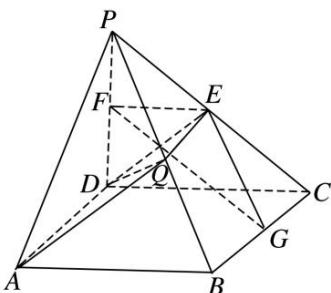

> [!faq]- 《专题09 立体几何中的探索性问题-立体几何（文科）》例题解析
>
> > [!success]- **【答案】** C
>
> > [!note]- **【解析】**
> > 解析
> > (1)∵ 在△PCD 中，E, F 分别是 PC, PD 的中点，∴ EF∥CD，又∵ 四边形 ABCD 为正方形，∴ AB∥CD，∴ EF∥AB，∵ EF∉平面 PAB，AB⊂平面 PAB，∴ EF∥平面 PAB．同理 EG∥平面 PAB，∵ EF，EG 是平面 EFG 内两条相交直线，∴ 平面 PAB∥平面 EFG．
> >
> > 
> >
> > (2)当 Q 为线段 PB 的中点时， $PC \perp$ 平面 ADQ．取 PB 的中点 Q，连接 DE，EQ，AQ，DQ，
> >
> > ∵EQ∥BC∥AD，且AD≠QE，∴四边形ADEQ为梯形，
> >
> > 由 $PD \perp$ 平面 ABCD， $AD \subset$ 平面 ABCD，得 $AD \perp PD$ ，
> >
> > $\because AD \perp CD, PD \cap CD = D, PD, CD \subset$ 平面 $PCD, \therefore AD \perp$ 平面 $PDC$ , 又 $PC \subset$ 平面 $PDC, \therefore AD \perp PC$ . $\because \triangle PDC$ 为等腰直角三角形, $E$ 为斜边中点, $\therefore DE \perp PC$ ,
> >
> > ∵AD，DE是平面ADQ内的两条相交直线，∴PC⊥平面ADQ.
