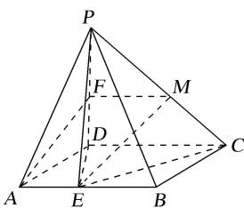

> [!faq]- 《专题09 立体几何中的探索性问题-立体几何（文科）》例题解析
>
> > [!success]- **【答案】** D
>
> > [!note]- **【解析】**
> > 解析
> > (1)如图作 $FM \parallel CD$ , 交 $PC$ 于点 $M$ , 连接 $EM$ ,
> >
> > 因为点 $F$ 为 $PD$ 的中点，所以 $FM = \frac{1}{2} CD$ 。因为 $m = \frac{1}{2}$ ，所以 $AE = \frac{1}{2} AB = FM$ ，
> >
> > 又 $FM \parallel CD \parallel AE$ ，所以四边形 $AEMF$ 为平行四边形，所以 $AF \parallel EM$ ，
> >
> > 因为 $AF \not\subset$ 平面 PEC，EM⊂平面 PEC，所以直线 AF∥平面 PEC.
> >
> > (2)存在一个常数 $m = \frac{\sqrt{3}}{2}$ ，使得平面 $PED \perp$ 平面 $PAB$ ，理由如下：
> >
> > 
> >
> > 要使平面 $PED \perp$ 平面 PAB，只需 $AB \perp DE$ ，
> >
> > 因为 AB=AD=2， $\angle DAB=30^{\circ}$ ，所以 $AE=AD\cos30^{\circ}=\sqrt{3}$ ，
> >
> > 又因为 $PD \perp$ 平面 ABCD， $PD \perp AB$ ， $PD \cap DE = D$ ，所以 $AB \perp$ 平面 PDE，
> >
> > 因为 $AB \subset$ 平面 PAB，所以平面 $PDE \perp$ 平面 PAB，所以 $m = \frac{AE}{AB} = \frac{\sqrt{3}}{2}$ .
