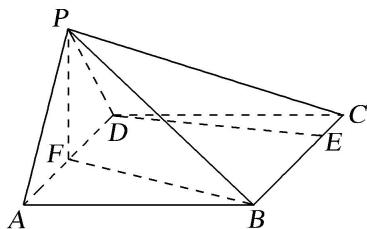
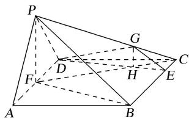

> [!faq]- 《专题09 立体几何中的探索性问题-立体几何（文科）》例题解析
>
> > [!success]- **【答案】** 详见解析
>
> > [!note]- **【分析】**
> > 本题未单列分析。
>
> > [!note]- **【解析】**
> > (1)求证： $AD\bot PB$
> >
> > (2)若 E 在线段 BC 上，且 $EC=\frac{1}{4}BC$ ，能否在棱 PC 上找到一点 G，使平面 $DEG \perp$ 平面 ABCD？若存在，求出三棱锥 D-CEG 的体积；若不存在，请说明理由.
> >
> > 
> >
> > 7. 解析
> > (1)∵△PAD 是等边三角形，F 是 AD 的中点，∴PF⊥AD.
> >
> > 
> >
> > ∵底面 ABCD 是菱形， $\angle BAD=\frac{\pi}{3}$ ，∴ $BF\perp AD$ .
> >
> > 又 $PF \cap BF = F,\quad \therefore AD \perp$ 平面 BFP. 由于 $PB \subset$ 平面 BFP, $\therefore AD \perp PB$ .
> >
> > (2)能在棱 PC 上找到一点 G，使平面 $DEG \perp$ 平面 ABCD.
> >
> > 由
> > (1)知 $AD \perp BF$ ，∵ $PD \perp BF$ ， $AD \cap PD = D$ ，∴ $BF \perp$ 平面 PAD.
> >
> > 又 $BF \subset$ 平面 ABCD，∴平面 ABCD ⊥ 平面 PAD，
> >
> > 又平面 $ABCD \cap$ 平面 PAD = AD，且 $PF \perp AD$ ， $PF \subset$ 平面 PAD，∴ $PF \perp$ 平面 ABCD.
> >
> > 连接 CF 交 DE 于点 H，过 H 作 HG // PF 交 PC 于 G，∴ GH ⊥ 平面 ABCD.
> >
> > 又 $GH \subset$ 平面 DEG，∴平面 $DEG \perp$ 平面 ABCD.
> >
> > $\because AD \parallel BC, \therefore \triangle DFH \sim \triangle ECH, \therefore \frac{CH}{HF} = \frac{CE}{DF} = \frac{1}{2}, \therefore \frac{CG}{GP} = \frac{CH}{HF} = \frac{1}{2}, \therefore GH = \frac{1}{3} PF = \frac{\sqrt{3}}{3},$
> >
> > $$
> > \therefore V _ {D - C E G} = V _ {G - C D E} = \frac {1}{3} S _ {\triangle C D E} \cdot G H = \frac {1}{3} \times \frac {1}{2} D C \cdot C E \cdot \sin \frac {\pi}{3} \cdot G H = \frac {1}{1 2}.
> > $$
