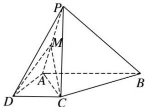
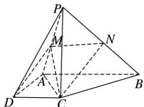

> [!faq]- 《专题09 立体几何中的探索性问题-立体几何（文科）》例题解析
>
> > [!success]- **【答案】** 详见解析
>
> > [!note]- **【解析】**
> > 解析
> > (1) 连接 AC，在直角梯形 ABCD 中， $AC=\sqrt{AD^{2}+DC^{2}}=2\sqrt{2}$
> >
> > $BC = \sqrt{(AB - CD)^2 + AD^2} = 2\sqrt{2}$ ，所以 $AC^{2} + BC^{2} = AB^{2}$ ，即 $AC\bot BC$
> >
> > 又 $PC \perp$ 平面 ABCD， $BC \subset$ 平面 ABCD，
> >
> > 所以 $PC \perp BC$ ，又 $AC \cap PC = C$ ，AC， $PC \subset$ 平面 PAC，故 $BC \perp$ 平面 PAC.
> >
> > 
> >
> > (2)N 为 PB 的中点，连接 MN，CN.
> >
> > 
> >
> > 因为 M 为 PA 的中点，N 为 PB 的中点，所以 $MN \parallel AB$ ，且 $MN = \frac{1}{2} AB = 2$ .
> >
> > 又因为 $AB \parallel CD$ ，所以 $MN \parallel CD$ ，所以 M，N，C，D 四点共面，
> >
> > 所以 N 为过 C, D, M 三点的平面与线段 PB 的交点.
> >
> > 因为 $BC \perp$ 平面 PAC，N 为 PB 的中点，所以点 N 到平面 PAC 的距离 $d = \frac{1}{2} BC = \sqrt{2}$ .
> >
> > 又 $S_{\triangle ACM} = \frac{1}{2} S_{\triangle ACP} = \frac{1}{2}\times \frac{1}{2}\times AC\times PC = \sqrt{2}$ ，所以 $V_{\text{三棱锥} N - ACM} = \frac{1}{3}\times \sqrt{2}\times \sqrt{2} = \frac{2}{3}.$
> >
> > 由题意可知，在 Rt△PCA 中， $PA=\sqrt{AC^{2}+PC^{2}}=2\sqrt{3}$ ， $CM=\sqrt{3}$
> >
> > 在 Rt△PCB 中， $PB=\sqrt{BC^{2}+PC^{2}}=2\sqrt{3}$ ，CN= $\sqrt{3}$ ，所以 $S_{\triangle CMN}=\frac{1}{2}\times2\times\sqrt{2}=\sqrt{2}$ .
> >
> > 设三棱锥 A—CMN 的高为 h， $V_{三棱锥 N—ACM}=V_{三棱锥 A—CMN}=\frac{1}{3}\times\sqrt{2}\times h=\frac{2}{3}$
> >
> > 解得 $h=\sqrt{2}$ ，故三棱锥 A—CMN 的高为 $\sqrt{2}$ .
