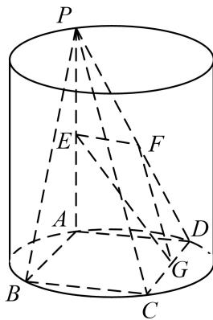

<!-- question-source:start -->
[例 1]如图所示，圆柱的高为2，点A，B，C，D分别是圆柱下底面圆周上的点，ABCD为矩形，PA是圆柱的母线，AB=2，BC=4，E，F，G分别是线段PA，PD，CD的中点.

(1)求证：平面 $PDC \perp$ 平面 PAD;

(2)求证： $PB / /$ 平面EFG;

(3)在线段 $BC$ 上是否存在一点 $M$ ，使得 $D$ 到平面 $PAM$ 的距离为 2？若存在，求出 $BM$ ；若不存在，请说明理由.

<!-- question-source:end -->

![[高中/总复习/专题/立体几何/专题09 立体几何中的探索性问题-立体几何（文科）/考点03_探究距离与体积问题/例题/answers/Q00043645A1.md]]
