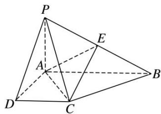

<!-- question-source:start -->
[例 2]如图，在四棱锥 P—ABCD 中，PA⊥底面 ABCD，AD⊥AB，DC∥AB，PA=1，AB=2，PD=BC = $\sqrt{2}$ .

(1)求证：平面 $PAD \perp$ 平面 PCD;

(2)试在棱 $PB$ 上确定一点 $E$ , 使截面 $AEC$ 把该几何体分成的两部分 $PDCEA$ 与 $EACB$ 的体积比为 $2:1$ .

<!-- question-source:end -->

![[高中/总复习/专题/立体几何/专题09 立体几何中的探索性问题-立体几何（文科）/考点03_探究距离与体积问题/例题/answers/Q00043646A1.md]]
