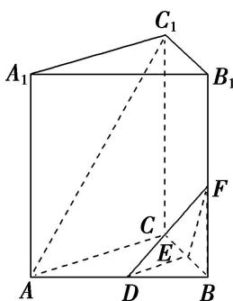

<!-- question-source:start -->
[例 3]如图，在正三棱柱 $ABC-A_{1}B_{1}C_{1}$ 中，D，E 分别为 AB，BC 的中点.

(1)若 F 为 $BB_{1}$ 的中点，判断 $AC_{1}$ 与平面 DEF 是否平行？若平行，请给予证明，若不平行，说明理由；

(2)试问：在侧棱 $BB_{1}$ 上是否存在点 $F$ ，使三棱锥 $F - DEB$ 的体积与三棱柱 $ABC - A_{1}B_{1}C_{1}$ 的体积之比为 $\frac{1}{8}$

<!-- question-source:end -->

![[高中/总复习/专题/立体几何/专题09 立体几何中的探索性问题-立体几何（文科）/考点03_探究距离与体积问题/例题/answers/Q00043647A1.md]]
