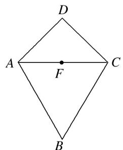
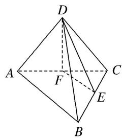

> [!faq]- 《专题09 立体几何中的探索性问题-立体几何（文科）》例题解析
>
> > [!success]- **【答案】** 详见解析
>
> > [!note]- **【分析】**
> > 本题未单列分析。
>
> > [!note]- **【解析】**
> > (1)求证： $AC \perp BD;$
> > (2)试问：在线段 BC 上是否存在一点 E，使得 $\frac{V_{C-DFE}}{V_{C-DBA}} = \frac{1}{4}$ ？若存在，请求出点 E 的位置；若不存在，请说明理由.
> > 
> > 图①
> > 
> > 图②
> > 解析 (1)证明： $AD = CD = 2$ ， $AC = 2\sqrt{2}$
> > 从而 $AD^{2}+CD^{2}=AC^{2}$ ，故 $AD\perp CD$ ， $\triangle ADC$ 是等腰直角三角形.
> > 又 F 为线段 AC 的中点，所以 $DF \perp AC$ ，连接 BF(图略)，因为 $\triangle ABC$ 是等边三角形，所以 $BF \perp AC$ ，又 $DF \cap BF = F$ ，故 $AC \perp$ 平面 BDF，又 $BD \subset$ 平面 BDF，所以 $AC \perp BD$ 。
> > (2)线段 $BC$ 上存在点 $E$ ，使得 $\frac{V_{C-DFE}}{V_{C-DBA}} = \frac{1}{4}$ ，且 $E$ 为线段 $BC$ 的中点.
> > 因为平面 $ADC \perp$ 平面 ABC，平面 $ADC \cap$ 平面 ABC = AC，且 $DF \perp AC$ ，
> > 所以 $DF \perp$ 平面 ABC，故 DF 为三棱锥 D-FCE 和 D-ABC 的高，
> > $$
> > \frac {V _ {C - D F E}}{V _ {C - D B A}} = \frac {V _ {D - F C E}}{V _ {D - A B C}} = \frac {S _ {\triangle F C E}}{S _ {\triangle A B C}} = \frac {\frac {1}{2} C F \cdot C E \cdot \sin \angle E C F}{\frac {1}{2} C A \cdot C B \cdot \sin \angle A C B} = \frac {C F}{C A} \cdot \frac {C E}{C B} = \frac {1}{4}.
> > $$
> > 又 F 为线段 AC 的中点，所以 $\frac{CF}{CA} = \frac{1}{2}$ ，故 $\frac{CE}{CB} = \frac{1}{2}$ ，
> > 从而 E 为线段 BC 的中点，即当 E 为线段 BC 的中点时， $\frac{V_{C-DFE}}{V_{C-DBA}}=\frac{1}{4}$ .
