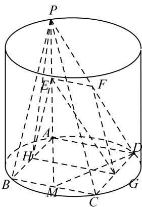

> [!faq]- 《专题09 立体几何中的探索性问题-立体几何（文科）》例题解析
>
> > [!success]- **【答案】** 详见解析
>
> > [!note]- **【解析】**
> > 解析
> > (1)∵ PA 是圆柱的母线，∴ $PA \perp$ 圆柱的底面.
> >
> > ∵ $CD \subset$ 圆柱的底面， $PA \perp CD$ ，又∵ ABCD 为矩形，∴ $CD \perp AD$ ，
> >
> > 而 $PA \perp AD = A$ ，∴ $CD \perp$ 平面 PAD．又 $CD \subset$ 平面 PDC，∴ 平面 $PDC \perp$ 平面 PAD．
> >
> > 
> >
> > (2)取 AB 中点 H，连接 GH, HE，∵ E、F、G 分别是线段 PA、PD、CD 的中点，∴ GH // AD // EF，∴ E、F、G、H 四点共面．又 H 为 AB 中点，∴ EH // PB．又 $EH \subset$ 平面 EFG， $PB \not\subset$ 平面 EFG，∴ PB // 平面 EFG．
> >
> > (3)
> > 解析：假设在 $BC$ 上存在一点 $M$ ，使得 $D$ 到平面 $PAM$ 的距离为2，则以 $\Delta PAM$ 为底， $D$ 为顶点的三棱锥的高为2，连接 $AM$ ，则 $AM = \sqrt{AB^2 + BM^2} = \sqrt{4 + BM^2}$ ，由
> > (2)知 $PA\bot AM$ ，
> >
> > $$
> > \therefore S _ {\triangle P A M} = \frac {1}{2} P A \cdot A M = \frac {1}{2} \times 2 \sqrt {2 ^ {2} + B M ^ {2}} = \sqrt {4 + B M ^ {2}}, \quad \therefore V _ {D - P A M} = \frac {1}{3} \cdot S _ {\triangle P A M} \cdot 2 = \frac {2}{3} \sqrt {4 + B M ^ {2}}.
> > $$
> >
> > $$
> > \because S _ {\triangle A M D} = \frac {1}{2} A D \cdot A B = \frac {1}{2} \times 4 \times 2 = 4, \quad \therefore V _ {P - A D M} = \frac {1}{3} \cdot S _ {\triangle A D M} \cdot P A = \frac {1}{3} \times 4 \times 2 = \frac {8}{3}.
> > $$
> >
> > \(\because V\_{D - PAM} = V\_{P - ADM}, \therefore \frac{2}{3}\sqrt{4 + BM^2} = \frac{8}{3}\)，解得：\(BM = 2\sqrt{3}\)。\$\because 2\sqrt{3} < 4\)，
> >
> > ∴线段 BC 上存在一点 M，当 $BM = 2\sqrt{3}$ 时，使得 D 到平面 PAM 的距离为 2.
