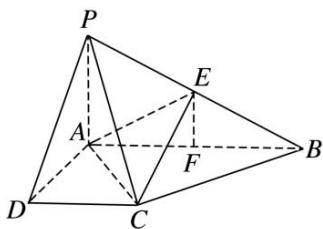

> [!faq]- 《专题09 立体几何中的探索性问题-立体几何（文科）》例题解析
>
> > [!success]- **【答案】** 详见解析
>
> > [!note]- **【解析】**
> > 解析
> > (1) $\because AD \perp AB, DC \parallel AB, \therefore DC \perp AD.$ $\because PA \perp$ 平面 $ABCD, DC \subset$ 平面 $ABCD, \therefore DC \perp PA.$ $\because AD \cap PA = A, AD, PA \subset$ 平面 $PAD, \therefore DC \perp$ 平面 $PAD.$ $\because DC \subset$ 平面 $PCD, \therefore$ 平面 $PAD \perp$ 平面 $PCD.$
> >
> > 
> >
> > (2)作 $EF \perp AB$ 于 F 点，∵ 在 $\triangle ABP$ 中， $PA \perp AB$ ，∴ $EF \parallel PA$ ，∴ $EF \perp$ 平面 ABCD.
> >
> > 设 EF=h， $AD=\sqrt{PD^{2}-PA^{2}}=1$ ， $S_{\triangle ABC}=\frac{1}{2}AB\cdot AD=1$ ，则 $V_{三棱锥 E-ABC}=\frac{1}{3}S_{\triangle ABC}\cdot h=\frac{1}{3}h.$
> >
> > $$
> > V _ {\text { 四棱锥 } P - A B C D} = \frac {1}{3} S _ {\text { 四边形 } A B C D} \cdot P A = \frac {1}{3} \times \frac {(1 + 2) \times 1}{2} \times 1 = \frac {1}{2}.
> > $$
> >
> > 由 $V_{PDCEA}:V_{三棱锥E-ACB}=2:1$ ，得 $\left(\frac{1}{2}-\frac{1}{3}h\right):\frac{1}{3}h=2:1$ ，解得 $h=\frac{1}{2}$ . $EF=\frac{1}{2}PA$ ，故 E 为 PB 的中点.
