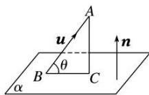

<!-- source-part:1 pages:1-32 -->

## 专题10 利用空间向量计算线面角的问题

## 【方法总结】

## 1. 直线与平面所成的角

如图，直线 AB 与平面 $\alpha$ 相交于点 B，设直线 AB 与平面 $\alpha$ 所成的角为 $\theta$ ，直线 AB 的方向向量为 u，平面 $\alpha$ 的法向量为 n，则 $\sin\theta=|\cos<u,\quad n>|=\frac{|u\cdot n|}{|u||n|}$ .

## 2. 利用向量求线面角的 2 种方法

(1)分别求出斜线和它所在平面内的射影直线的方向向量，转化为求两个方向向量的夹角(或其补角);

(2)通过平面的法向量来求，即求出斜线的方向向量与平面的法向量所夹的锐角，取其余角就是斜线与平面所成的角.

## 【例题选讲】

![[高中/总复习/专题/立体几何/专题10 利用空间向量计算线面角的问题-立体几何（理科）/考点01_棱柱_台_模型/考点01_棱柱_台_模型.md]]
![[高中/总复习/专题/立体几何/专题10 利用空间向量计算线面角的问题-立体几何（理科）/考点02_棱_圆_锥模型/考点02_棱_圆_锥模型.md]]
![[高中/总复习/专题/立体几何/专题10 利用空间向量计算线面角的问题-立体几何（理科）/考点03_不规则几何体模型/考点03_不规则几何体模型.md]]
