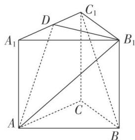

<!-- question-source:start -->
[例 1] 如图，在三棱柱 $ABC-A_{1}B_{1}C_{1}$ 中， $CC_{1}\perp$ 底面 ABC， $AC\perp BC$ ，D 是 $A_{1}C_{1}$ 的中点，且 AC=BC = $AA_{1}=2$ .

(1)求证： $BC_{1} \parallel$ 平面 $AB_{1}D$ ;

(2)求直线 BC 与平面 $AB_{1}D$ 所成角的正弦值.

<!-- question-source:end -->

![[高中/总复习/专题/立体几何/专题10 利用空间向量计算线面角的问题-立体几何（理科）/考点01_棱柱_台_模型/例题/answers/Q00043649A1.md]]
