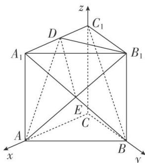

<!-- question-source:start -->
[例 1] 如图，在三棱柱 $ABC-A_{1}B_{1}C_{1}$ 中， $CC_{1}\perp$ 底面 ABC， $AC\perp BC$ ，D 是 $A_{1}C_{1}$ 的中点，且 AC=BC = $AA_{1}=2$ .

(1)求证： $BC_{1} \parallel$ 平面 $AB_{1}D$ ;

(2)求直线 BC 与平面 $AB_{1}D$ 所成角的正弦值.

(1)如图，连接 $A_{1}B$ 。设 $A_{1}B \cap AB_{1} = E$ ，连接 $DE$ .

由 $ABC-A_{1}B_{1}C_{1}$ 为三棱柱，得 E 为 $A_{1}B$ 的中点.

又 D 是 $A_{1}C_{1}$ 的中点，所以 $BC_{1} \parallel DE$ 。又 $BC_{1} \not\subset$ 平面 $AB_{1}D$ ， $DE \subset$ 平面 $AB_{1}D$ ，所以 $BC_{1} \parallel$ 平面 $AB_{1}D$ 。
(2)因为 $CC_{1}\perp$ 底面 ABC，AC⊥BC，所以 CA，CB， $CC_{1}$ 两两垂直，以 C 为坐标原点，

以 CA, CB, $CC_{1}$ 所在直线分别为 x 轴、y 轴、z 轴建立空间直角坐标系，

则 $C(0, 0, 0)$ ， $B(0, 2, 0)$ ， $A(2, 0, 0)$ ， $B_{1}(0, 2, 2)$ ， $D(1, 0, 2)$ ，

所以 $\overrightarrow{AB_{1}}=(-2,2,2)$ ， $\overrightarrow{B_{1}D}=(1,-2,0)$ ， $\overrightarrow{BC}=(0,-2,0)$ .

设平面 $AB_{1}D$ 的法向量为 $\boldsymbol{n}=(x,y,z)$ ，则 $\left\{\begin{aligned}\overrightarrow{AB_{1}}\cdot\boldsymbol{n}&=0,\\ \overrightarrow{B_{1}D}\cdot\boldsymbol{n}&=0,\end{aligned}\right.$ 得 $\left\{\begin{aligned}-2x+2y+2z&=0,\\ x-2y&=0,\end{aligned}\right.$

令 y=1，得 x=2，z=1，所以 $n=(2,1,1)$ .

设直线 BC 与平面 $AB_{1}D$ 所成的角为 $\theta$ ，则 $\sin\theta=|\cos<\overrightarrow{BC}, n>|= \left|\frac{\overrightarrow{BC}\cdot n}{|\overrightarrow{BC}||n|}\right|=\frac{\sqrt{6}}{6}$ ,

所以直线 BC 与平面 $AB_{1}D$ 所成角的正弦值为 $\frac{\sqrt{6}}{6}$ .
<!-- question-source:end -->

![[高中/总复习/专题/立体几何/专题10 利用空间向量计算线面角的问题-立体几何（理科）/考点01_棱柱_台_模型/例题/answers/Q00043649A1.md]]
