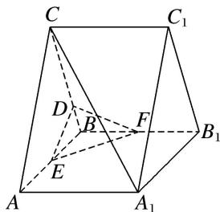

<!-- question-source:start -->
[例2] 在直三棱柱 $ABC - A_{1}B_{1}C_{1}$ 中， $\triangle ABC$ 为正三角形，点 $D$ 在棱 $BC$ 上，且 $CD = 3BD$ ，点 $E$ ， $F$ 分别为棱 $AB$ ， $BB_{1}$ 的中点.

(1)证明： $A_{1}C \parallel$ 平面 DEF;

(2)若 $A_{1}C \perp EF$ ，求直线 $A_{1}C_{1}$ 与平面 DEF 所成的角的正弦值.

<!-- question-source:end -->

![[高中/总复习/专题/立体几何/专题10 利用空间向量计算线面角的问题-立体几何（理科）/考点01_棱柱_台_模型/例题/answers/Q00043650A1.md]]
