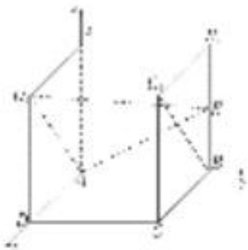

<!-- question-source:start -->
[例 3] (2020·北京)如图，在正方体 $ABCD-A_{1}B_{1}C_{1}D_{1}$ 中，E 为 $BB_{1}$ 的中点.

(1)求证： $BC_{1}$ // 平面 $AD_{1}E$ ;

(2)求直线 $AA_{1}$ 与平面 $AD_{1}E$ 所成角的正弦值.

(1)在正方体 $ABCD - A_1B_1C_1D_1$ 中， $AB \parallel A_1B_1$ 且 $AB = A_1B_1$ ， $A_1B_1 \parallel C_1D_1$ 且 $A_1B_1 = C_1D_1$ ， $\therefore AB \parallel C_1D_1$ 且 $AB = C_1D_1$ ， $\therefore$ 四边形 $ABC_1D_1$ 为平行四边形， $\therefore BC_1 \parallel AD_1$

∵ $BC_{1}$ ∉平面 $AD_{1}E$ ， $AD_{1} \subset$ 平面 $AD_{1}E$ ，∴ $BC_{1}$ // 平面 $AD_{1}E$ .

(2)以点 A 为坐标原点，AD，AB， $AA_{1}$ 所在直线分别为 x 轴、y 轴、z 轴，建立如图所示的空间直角坐标系 Axyz，

设正方体 $ABCD-A_{1}B_{1}C_{1}D_{1}$ 的棱长为 2，则 $A(0,0,0)$ ， $A_{1}(0,0,2)$ ， $D_{1}(2,0,2)$ ， $E(0,2,1)$ ， $\overrightarrow{AA_{1}}=(0,0,2)$ ， $\overrightarrow{AD_{1}}=(2,0,2)$ ， $\overrightarrow{AE}=(0,2,1)$ .

设平面 $AD_{1}E$ 的法向量为 $\boldsymbol{n}=(x,y,z)$ ，由 $\left\{\begin{aligned}\boldsymbol{n}\cdot\overrightarrow{AD_{1}}&=0,\\ \boldsymbol{n}\cdot\overrightarrow{AE}&=0,\end{aligned}\right.$ 得 $\left\{\begin{aligned}2x+2z&=0,\\ 2y+z&=0,\end{aligned}\right.$

令 z=-2，则 x=2，y=1，则 $n=(2,1,-2)$ 。 $\cos<n,\quad\overrightarrow{AA_{1}}>=\frac{\boldsymbol{n}\cdot\overrightarrow{AA_{1}}}{|\boldsymbol{n}||\overrightarrow{AA_{1}}|}=\frac{-4}{3\times2}=-\frac{2}{3}.$

因此，直线 $AA_{1}$ 与平面 $AD_{1}E$ 所成角的正弦值为 $\frac{2}{3}$ .
<!-- question-source:end -->

![[高中/总复习/专题/立体几何/专题10 利用空间向量计算线面角的问题-立体几何（理科）/考点01_棱柱_台_模型/例题/answers/Q00043651A1.md]]
