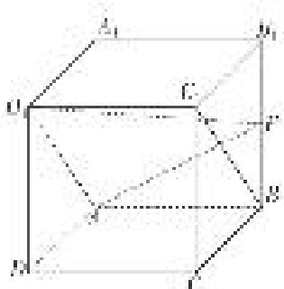

<!-- question-source:start -->
[例 3] (2020·北京)如图，在正方体 $ABCD-A_{1}B_{1}C_{1}D_{1}$ 中，E 为 $BB_{1}$ 的中点.

(1)求证： $BC_{1}$ // 平面 $AD_{1}E$ ;

(2)求直线 $AA_{1}$ 与平面 $AD_{1}E$ 所成角的正弦值.

<!-- question-source:end -->

![[高中/总复习/专题/立体几何/专题10 利用空间向量计算线面角的问题-立体几何（理科）/考点01_棱柱_台_模型/例题/answers/Q00043651A1.md]]
