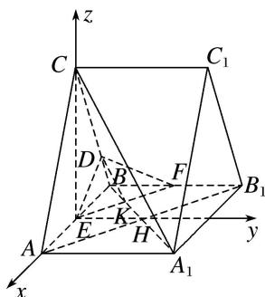

> [!faq]- 《专题10 利用空间向量计算线面角的问题-立体几何（理科）》例题解析
>
> > [!success]- **【答案】** 详见解析
>
> > [!note]- **【解析】**
> > 解析
> > (1)如图，连接 $AB_{1}$ ， $A_{1}B$ 交于点 $H$ ，设 $A_{1}B$ 交 $EF$ 于点 $K$ ，连接 $DK$ ，
> >
> > 
> >
> > 因为四边形 $ABB_{1}A_{1}$ 为矩形，所以 H 为线段 $A_{1}B$ 的中点.
> >
> > 因为点 E, F 分别为棱 AB, $BB_{1}$ 的中点，所以点 K 为线段 BH 的中点，所以 $A_{1}K=3BK$ .
> >
> > 又 CD=3BD，所以 $A_{1}C \parallel DK$ 。又 $A_{1}C \not\subset$ 平面 DEF， $DK \subset$ 平面 DEF，所以 $A_{1}C \parallel$ 平面 DEF。
> >
> > (2)连接 CE, EH, 由
> > (1)知, $EH \parallel AA_{1}$ , 因为 $AA_{1} \perp$ 平面 ABC, 所以 $EH \perp$ 平面 ABC.
> >
> > 因为 $\triangle ABC$ 为正三角形，且点E为棱AB的中点，所以 $CE\perp AB$ .
> >
> > 故以点 E 为坐标原点，分别以 $\overrightarrow{EA}, \overrightarrow{EH}, \overrightarrow{EC}$ 的方向为 x 轴、y 轴、z 轴的正方向建立如图所示的空间直角坐标系 Exyz.
> >
> > 设 $AB = 4$ ， $AA_{1} = t(t > 0)$ ，则 $E(0,0,0)$ ， $A_{1}(2,t,0)$ ， $A(2,0,0)$ ， $C(0,0,2\sqrt{3})$ ， $F\left(-2,\frac{t}{2},0\right),$ $D\left[-\frac{3}{2},0,\frac{\sqrt{3}}{2}\right],$
> >
> > 所以 $\vec{A_1C} = (-2, -t, 2\sqrt{3})$ ， $\vec{EF} = \left(-2, \frac{t}{2}, 0\right)$ .
> >
> > 因为 $A_{1}C \perp EF$ ，所以 $\overrightarrow{A_1C} \cdot \overrightarrow{EF} = 0$ ，所以 $(-2) \times (-2) - t \times \frac{t}{2} + 2\sqrt{3} \times 0 = 0$ ，所以 $t = 2\sqrt{2}$ ，
> >
> > 所以 $\overrightarrow{EF}=(-2,\sqrt{2},0)$ ， $\overrightarrow{ED}=\left(-\frac{3}{2},0,\frac{\sqrt{3}}{2}\right)$ .
> >
> > 设平面 $DEF$ 的一个法向量为 $\pmb {n} = (x,y,z)$ ，则 $\left\{ \begin{array}{l}\overrightarrow{EF}\cdot \pmb {n} = 0,\\ \overrightarrow{ED}\cdot \pmb {n} = 0, \end{array} \right.$ 所以 $\left\{ \begin{array}{l} - 2x + \sqrt{2} y = 0,\\ -\frac{3}{2} x + \frac{\sqrt{3}}{2} z = 0. \end{array} \right.$
> >
> > 取 $x = 1$ ，则 $\pmb {n} = (1,\sqrt{2},\sqrt{3})$ 又 $\overrightarrow{A_1C_1} = \overrightarrow{AC} = (-2,0,2\sqrt{3}),$
> >
> > 设直线 $A_{1}C_{1}$ 与平面 DEF 所成的角为 $\theta$ ,
> >
> > $$
> > \sin \theta = | \cos \langle \boldsymbol {n}, \overrightarrow {A _ {1} C _ {1}} \rangle | = \frac {| \boldsymbol {n} \cdot \overrightarrow {A _ {1} C _ {1}} |}{| \boldsymbol {n} | | \overrightarrow {A _ {1} C _ {1}} |} = \frac {4}{\sqrt {6} \times 4} = \frac {\sqrt {6}}{6},
> > $$
> >
> > 所以直线 $A_{1}C_{1}$ 与平面 DEF 所成的角的正弦值为 $\frac{\sqrt{6}}{6}$ .
