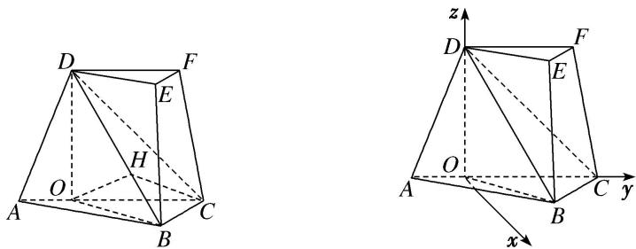

> [!faq]- 《专题10 利用空间向量计算线面角的问题-立体几何（理科）》例题解析
>
> > [!success]- **【答案】** 详见解析
>
> > [!note]- **【解析】**
> > 解析
> > (1)如图, 过点 $D$ 作 $DO \perp AC$ , 交直线 $AC$ 于点 $O$ , 连接 $OB$ .
> >
> > 由 $\angle ACD=45^{\circ}$ ，DO⊥AC 得 $CD=\sqrt{2}CO$ .
> >
> > 由平面 $ACFD \perp$ 平面 ABC，得 $DO \perp$ 平面 ABC，所以 $DO \perp BC$ .
> >
> > 由 $\angle ACB = 45^{\circ}$ ， $BC = \frac{1}{2} CD = \frac{\sqrt{2}}{2} CO$ 得 $BO\bot BC$ ，所以 $BC\bot$ 平面 $BDO$ ，故 $BC\bot DB$
> >
> > 由三棱台 ABC-DEF 得 BC//EF，所以 $EF \perp DB$ .
> >
> > 
> >
> > (2)法一：如图，过点 O 作 $OH \perp BD$ ，交直线 BD 于点 H，连接 CH.
> >
> > 由三棱台 $ABC-DEF$ 得 $DF \parallel CO$ , 所以直线 $DF$ 与平面 $DBC$ 所成角等于直线 $CO$ 与平面 $DBC$ 所成角. 由 $BC \perp$ 平面 $BDO$ 得 $OH \perp BC$ , 故 $OH \perp$ 平面 $BCD$ , 所以 $\angle OCH$ 为直线 $CO$ 与平面 $DBC$ 所成角. 设 $CD = 2\sqrt{2}$ .
> >
> > 由 DO=OC=2， $BO=BC=\sqrt{2}$ ，得 $BD=\sqrt{6}$ ， $OH=\frac{2}{3}\sqrt{3}$ ，所以 $\sin\angle OCH=\frac{OH}{OC}=\frac{\sqrt{3}}{3}$ ，
> >
> > 因此，直线 $DF$ 与平面 $DBC$ 所成角的正弦值为 $\frac{\sqrt{3}}{3}$ .
> >
> > 法二：由三棱台 ABC-DEF 得 $DF \parallel CO$ ,
> >
> > 所以直线 DF 与平面 DBC 所成角等于直线 CO 与平面 DBC 所成角，记为 $\theta$ .
> >
> > 如图，以 O 为原点，分别以射线 OC，OD 为 y，z 轴的正半轴，建立空间直角坐标系 O-xyz.
> >
> > 设 $CD = 2\sqrt{2}$ ，由题意知各点坐标如下：
> >
> > $O(0, 0, 0)$ , $B(1, 1, 0)$ , $C(0, 2, 0)$ , $D(0, 0, 2)$ .
> >
> > 因此 $\overrightarrow{OC}=(0,2,0)$ ， $\overrightarrow{BC}=(-1,1,0)$ ， $\overrightarrow{CD}=(0,-2,2)$ .
> >
> > 设平面 BCD 的法向量 $n=(x, y, z)$ .
> >
> > 由 $\left\{\begin{aligned}n\cdot\overrightarrow{BC}&=0,\\ n\cdot\overrightarrow{CD}&=0,\end{aligned}\right.$ 即 $\left\{\begin{aligned}-x+y&=0,\\ -2y+2z&=0,\end{aligned}\right.$ 可取 $n=(1,1,1)$ .
> >
> > 所以 $\sin\theta=|\cos<\overrightarrow{OC},\quad n>|\frac{|\overrightarrow{OC}\cdot n|}{|\overrightarrow{OC}|\cdot|n|}=\frac{\sqrt{3}}{3}.$
> >
> > 因此，直线 $DF$ 与平面 $DBC$ 所成角的正弦值为 $\frac{\sqrt{3}}{3}$ .
> >
> > ## 【对点训练】
