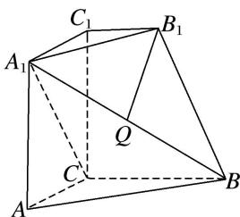

<!-- question-source:start -->
4. 如图，在几何体 $ABC - A_{1}B_{1}C_{1}$ 中，平面 $A_{1}ACC_{1} \perp$ 底面 $ABC$ ，四边形 $A_{1}ACC_{1}$ 是正方形， $B_{1}C_{1} // BC$ ， $Q$ 是 $A_{1}B$ 的中点，且 $AC = BC = 2B_{1}C_{1}$ ， $\angle ACB = \frac{2\pi}{3}$ .

(1)证明： $B_{1}Q \perp A_{1}C;$

(2)求直线 AC 与平面 $A_{1}BB_{1}$ 所成角的正弦值.

<!-- question-source:end -->

![[高中/总复习/专题/立体几何/专题10 利用空间向量计算线面角的问题-立体几何（理科）/考点01_棱柱_台_模型/对点训练/answers/Q00043656A1.md]]
