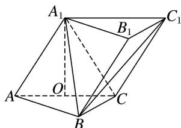
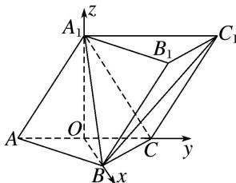

> [!faq]- 《专题10 利用空间向量计算线面角的问题-立体几何（理科）》例题解析
>
> > [!success]- **【答案】** 详见解析
>
> > [!note]- **【分析】**
> > 本题未单列分析。
>
> > [!note]- **【解析】**
> > (1)证明： $A_{1}O\perp$ 平面ABC；
> > (2)求直线 $AB$ 与平面 $A_{1}BC_{1}$ 所成角的正弦值.
> > 
> > 1. 解析 (1) $\because AA_{1}=A_{1}C$ ，且O为AC的中点， $\therefore A_{1}O\perp AC$
> > 又∵平面 $AA_{1}C_{1}C \perp$ 平面 ABC，平面 $AA_{1}C_{1}C \cap$ 平面 ABC = AC， $A_{1}O \subset$ 平面 $AA_{1}C_{1}C$ ，∴ $A_{1}O \perp$ 平面 ABC.
> > (2)如图，以 O 为原点，OB，OC， $OA_{1}$ 所在直线分别为 x 轴、y 轴、z 轴建立空间直角坐标系.
> > 
> > 由已知可得 $O(0, 0, 0)$ ， $A(0, -1, 0)$ ， $B(\sqrt{3}, 0, 0)$ ， $A_{1}(0, 0, \sqrt{3})$ ， $C_{1}(0, 2, \sqrt{3})$ ，
> > ∴ $\overrightarrow{AB}=(\sqrt{3},1,0),\overrightarrow{A_{1}B}=(\sqrt{3},0,-\sqrt{3}),\overrightarrow{A_{1}C_{1}}=(0,2,0)$
> > 设平面 $A_{1}BC_{1}$ 的法向量为 $\boldsymbol{n}=(x,y,z)$ ，则 $\left\{\begin{aligned}\boldsymbol{n}\cdot A_{1}\vec{C}_{1}&=0,\\ \boldsymbol{n}\cdot A_{1}\vec{B}&=0,\end{aligned}\right.$ 即 $\left\{\begin{aligned}2y&=0,\\\sqrt{3}x-\sqrt{3}z&=0,\end{aligned}\right.$
> > ∴平面 $A_{1}BC_{1}$ 的一个法向量为 $n=(1,0,1)$ ,
> > 设直线 AB 与平面 $A_{1}BC_{1}$ 所成的角为 $\alpha$ ，则 $\sin \alpha = |\cos < \overrightarrow{AB}, n > |$ ,
> > 又∵cos<AB，n>= $\frac{\overrightarrow{AB}\cdot n}{|\overrightarrow{AB}||n|}=\frac{\sqrt{3}}{2\sqrt{2}}=\frac{\sqrt{6}}{4}$
> > ∴AB与平面 $A_{1}BC_{1}$ 所成角的正弦值为 $\frac{\sqrt{6}}{4}$ .
