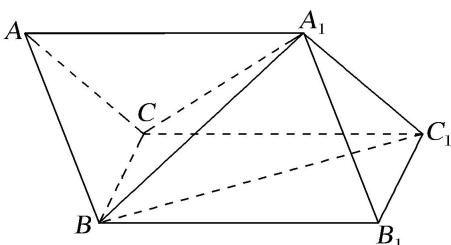
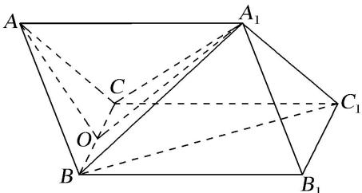
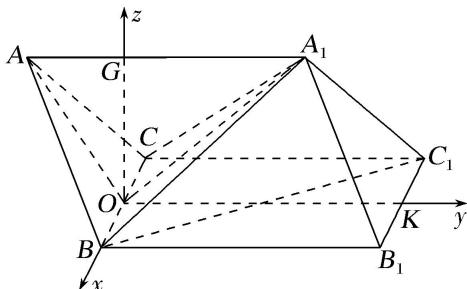

> [!faq]- 《专题10 利用空间向量计算线面角的问题-立体几何（理科）》例题解析
>
> > [!success]- **【答案】** 详见解析
>
> > [!note]- **【分析】**
> > 本题未单列分析。
>
> > [!note]- **【解析】**
> > (1)证明：平面 $A_{1}BC \perp$ 平面 $ABC$ ;
> > (2)求直线 $BC_{1}$ 与平面 $ABB_{1}A_{1}$ 所成角的正弦值.
> > 
> > 3. 解析 (1) $\because AB = 2, A_{1}B = \sqrt{7}, \angle A_{1}AB = 60^{\circ}$ ,
> > ∴由余弦定理得 $A_{1}B^{2}=AA_{1}^{2}+AB^{2}-2AA_{1}\cdot AB\cos\angle A_{1}AB$ ,
> > 即 $AA_{1}^{2}-2AA_{1}-3=0\Rightarrow AA_{1}=3$ 或 $AA_{1}=-1$ (舍)，故 $AA_{1}=3$ .
> > 取 BC 的中点 O，连接 OA， $OA_{1}$ ，∵ $\triangle ABC$ 是边长为 2 的正三角形，∴ $AO \perp BC$ ，且 $AO = \sqrt{3}$ ，BO = 1。由 AB = AC， $\angle A_{1}AB = \angle A_{1}AC$ ， $AA_{1} = AA_{1}$ 得 $\triangle A_{1}AB \cong \triangle A_{1}AC$ ，得 $A_{1}B = A_{1}C = \sqrt{7}$ ，
> > 故 $A_{1}O \perp BC$ ，且 $A_{1}O = \sqrt{6}$ .
> > $\because AO^{2}+A_{1}O^{2}=3+6=9=AA_{1}^{2},\quad\therefore AO\perp A_{1}O.$ 又 $BC\cap AO=O$ ，故 $A_{1}O\perp$ 平面 ABC，
> > $\because A_{1}O\subset$ 平面 $A_{1}BC,\therefore$ 平面 $A_{1}BC\perp$ 平面ABC.
> > 
> > 
> > (2)以 $O$ 为原点， $OB$ 所在的直线为 $x$ 轴，取 $B_{1}C_{1}$ 的中点 $K$ ，连接 $OK$ ，以 $OK$ 所在的直线为 $y$ 轴，过 $O$ 作 $OG \perp AA_{1}$ ，以 $OG$ 所在的直线为 $z$ 轴建立空间直角坐标系，
> > 则 $B(1, 0, 0)$ , $B_{1}(1, 3, 0)$ , $C_{1}(-1, 3, 0)$ , $A_{1}(0, 2, \sqrt{2})$ ,
> > $\therefore \overrightarrow{BC_1} = (-2, 3, 0), \overrightarrow{BB_1} = (0, 3, 0), \overrightarrow{BA_1} = (-1, 2, \sqrt{2}),$
> > 设 $\boldsymbol{m}=(x,y,1)$ 为平面 $ABB_{1}A_{1}$ 的法向量，
> > 则 $\left\{\begin{aligned}m\cdot\overrightarrow{BB_{1}}=3y=0,\\ m\cdot\overrightarrow{BA_{1}}=-x+2y+\sqrt{2}=0,\end{aligned}\right.\Rightarrow\left\{\begin{aligned}x=\sqrt{2},\\ y=0,\end{aligned}\right.\Rightarrow m=(\sqrt{2},0,1).$
> > 设直线 $BC_{1}$ 与平面 $ABB_{1}A_{1}$ 所成角为 $\theta$ ，则 $\sin \theta = \frac{|\overrightarrow{BC_1} \cdot \boldsymbol{m}|}{|\overrightarrow{BC_1}||\boldsymbol{m}|} = \frac{2\sqrt{2}}{\sqrt{13} \times \sqrt{3}} = \frac{2\sqrt{78}}{39}$ .
> > 故直线 $BC_{1}$ 与平面 $ABB_{1}A_{1}$ 所成角的正弦值为 $\frac{2\sqrt{78}}{39}$ .
