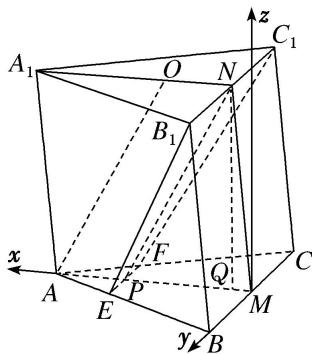

> [!faq]- 《专题10 利用空间向量计算线面角的问题-立体几何（理科）》例题解析
>
> > [!success]- **【答案】** 详见解析
>
> > [!note]- **【解析】**
> > 解析
> > (1) 因为 $M, N$ 分别为 $BC, B_{1}C_{1}$ 的中点，所以 $MN \parallel CC_{1}$ 。又由已知得 $AA_{1} \parallel CC_{1}$ ，故 $AA_{1} \parallel MN$ 。因为 $\triangle A_{1}B_{1}C_{1}$ 是正三角形，所以 $B_{1}C_{1} \perp A_{1}N$ 。又 $B_{1}C_{1} \perp MN$ ，故 $B_{1}C_{1} \perp$ 平面 $A_{1}AMN$ 。
> >
> > $$
> > A _ {1} A M N \perp
> > $$
> >
> > $$
> > E B _ {1} C _ {1} F
> > $$
> >
> > 
> >
> > (2)由已知得 $AM \perp BC$ 。以 $M$ 为坐标原点， $\overrightarrow{MA}$ 的方向为 $x$ 轴正方向， $|\overrightarrow{MB}|$ 为单位长，建立如图所示的空间直角坐标系 $M - xyz$ ，则 $AB = 2$ ， $AM = \sqrt{3}$ 。
> >
> > 连接 NP，则四边形 AONP 为平行四边形，故 $PM=\frac{2\sqrt{3}}{2}$ ， $E\left(\frac{2\sqrt{3}}{3},\frac{1}{3},0\right)$ .
> >
> > 由
> > (1)知平面 $A_{1}AMN \perp$ 平面 ABC.
> >
> > 作 $NQ \perp AM$ ，垂足为 $Q$ ，则 $NQ \perp$ 平面 $ABC$ 。设 $Q(a, 0, 0)$ ，则 $NQ = \sqrt{4 - \left(\frac{2\sqrt{3}}{3} - a\right)_2}$ ，
> >
> > $B_{1}\left(a,1,\sqrt{4-\left(\frac{2\sqrt{3}}{3}-a\right)_{2}}\right), \text{故}B_{1}E=\left(\frac{2\sqrt{3}}{3}-a,-\frac{2}{3},-\sqrt{4-\left(\frac{2\sqrt{3}}{3}-a\right)_{2}}\right), |B_{1}E|=\frac{2\sqrt{10}}{3}.$
> >
> > 又 $n=(0,-1,0)$ 是平面 $A_{1}AMN$ 的法向量，故
> >
> > $\sin \left( \frac{\pi}{2} - <n, \overrightarrow{B_1E} > \right) = \cos < n, \overrightarrow{B_1E} > = \frac{n \cdot \overrightarrow{B_1E}}{|n| \cdot |\overrightarrow{B_1E}|} = \frac{\sqrt{10}}{10}$ .
> >
> > 所以直线 $B_{1}E$ 与平面 $A_{1}AMN$ 所成角的正弦值为 $\frac{\sqrt{10}}{10}$ .
