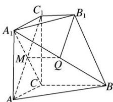
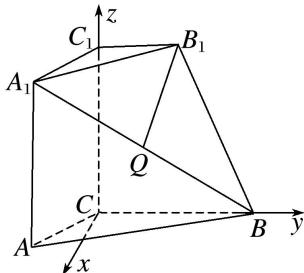

> [!faq]- 《专题10 利用空间向量计算线面角的问题-立体几何（理科）》例题解析
>
> > [!success]- **【答案】** 详见解析
>
> > [!note]- **【分析】**
> > 本题未单列分析。
>
> > [!note]- **【解析】**
> > (1)证明： $B_{1}Q \perp A_{1}C;$
> > (2)求直线 AC 与平面 $A_{1}BB_{1}$ 所成角的正弦值.
> > 
> > 4. 解析
> > (1)如图所示, 连接 $AC_{1}$ 与 $A_{1}C$ 交于 $M$ 点, 连接 $MQ$ .
> > 
> > ∵四边形 $A_{1}ACC_{1}$ 是正方形，∴M 是 $AC_{1}$ 的中点，又 Q 是 $A_{1}B$ 的中点，∴ $MQ \parallel BC$ ， $MQ = \frac{1}{2} BC$ ，
> > 又 $\because B_{1}C_{1} / / BC$ 且 $BC = 2B_{1}C_{1}$ ， $\therefore MQ / / B_1C_1$ ， $MQ = B_{1}C_{1}$
> > ∴四边形 $B_{1}C_{1}MQ$ 是平行四边形，∴ $B_{1}Q \parallel C_{1}M$ ，∵ $C_{1}M \perp A_{1}C$ ，∴ $B_{1}Q \perp A_{1}C$ .
> > (2)∵平面 $A_{1}ACC_{1}\perp$ 平面 ABC，平面 $A_{1}ACC_{1}\cap$ 平面 ABC=AC， $CC_{1}\perp AC$ ， $CC_{1}\subset$ 平面 $A_{1}ACC_{1}$ ，
> > ∴ $CC_{1} \perp$ 平面 ABC. 如图所示，以 C 为原点，CB, $CC_{1}$ 所在直线分别为 y 轴和 z 轴建立空间直角坐标系，令 $AC = BC = 2B_{1}C_{1} = 2$ ,
> > 
> > 则 $C(0, 0, 0)$ , $A(\sqrt{3}, -1, 0)$ , $A_{1}(\sqrt{3}, -1, 2)$ , $B(0, 2, 0)$ , $B_{1}(0, 1, 2)$ ,
> > $$
> > \therefore \overrightarrow {C A} = (\sqrt {3}, - 1, 0), \overrightarrow {B _ {1} A _ {1}} = (\sqrt {3}, - 2, 0), \overrightarrow {B _ {1} B} = (0, 1, - 2).
> > $$
> > 设平面 $A_{1}BB_{1}$ 的法向量为 $\boldsymbol{n}=(x,y,z)$ ，则由 $n\perp\overrightarrow{B_{1}A_{1}}$ ， $n\perp\overrightarrow{B_{1}B}$ ，
> > 可得 $\left\{\begin{aligned}\sqrt{3}x-2y=0,\\ y-2z=0,\end{aligned}\right.$ 可令 $y=2\sqrt{3}$ ，则x=4， $z=\sqrt{3}$
> > ∴平面 $A_{1}BB_{1}$ 的一个法向量 $n=(4,2\sqrt{3},\sqrt{3})$ ,
> > 设直线 $AC$ 与平面 $A_{1}BB_{1}$ 所成的角为 $\alpha$ ，则 $\sin \alpha = \frac{|\boldsymbol{n} \cdot \overrightarrow{CA}|}{|\boldsymbol{n}| \cdot |\overrightarrow{CA}|} = \frac{2\sqrt{3}}{2\sqrt{31}} = \frac{\sqrt{93}}{31}$ .
