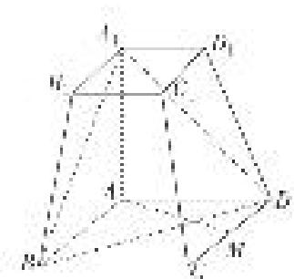
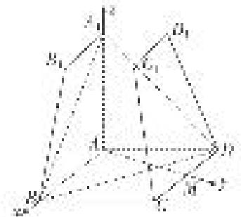

> [!faq]- 《专题10 利用空间向量计算线面角的问题-立体几何（理科）》例题解析
>
> > [!success]- **【答案】** 详见解析
>
> > [!note]- **【分析】**
> > 本题未单列分析。
>
> > [!note]- **【解析】**
> > (1)求证： $AM \perp$ 平面 $AA_{1}B_{1}B$ ;
> >
> > (2)求直线 $DD_{1}$ 与平面 $A_{1}BD$ 所成角的正弦值.
> >
> > 
> >
> > 5. 解析
> > (1)∵四边形ABCD为菱形， $\angle BAD=120^{\circ}$ ，连接AC，则 $\triangle ACD$ 为等边三角形，
> >
> > 又 M 为 CD 的中点，∴ $AM \perp CD$ ，又 $CD \parallel AB$ ，∴ $AM \perp AB$ ，
> >
> > $\because AA_{1} \perp$ 底面 ABCD, $AM \subset$ 底面 ABCD, $\therefore AM \perp AA_{1}$ ,
> >
> > 又 $AB \cap AA_{1} = A, \therefore AM \perp$ 平面 $AA_{1}B_{1}B.$
> >
> > (2)∵四边形ABCD为菱形， $\angle BAD=120^{\circ}$ ， $AB=AA_{1}=2A_{1}B_{1}=2$ ，
> >
> > $\therefore DM=1,\quad AM=\sqrt{3},\quad \therefore \angle AMD=\angle BAM=90^{\circ}$ ，又 $AA_{1}\perp$ 底面 ABCD，
> >
> > 以 A 为坐标原点，AB，AM， $AA_{1}$ 所在的直线分别为 x 轴、y 轴、z 轴，
> >
> > 建立如图所示的空间直角坐标系 Axyz，则 $A_{1}(0,0,2)$ ， $B(2,0,0)$ ， $D(-1,\sqrt{3},0)$ ， $D_{1}\left[-\frac{1}{2},\frac{\sqrt{3}}{2},2\right]$
> >
> > 
> >
> > $$
> > \therefore \overrightarrow {D D} _ {1} = \left(\frac {1}{2}, - \frac {\sqrt {3}}{2}, 2\right), \overrightarrow {B D} = (- 3, \sqrt {3}, 0, \overrightarrow {A _ {1} B} = (2, 0, - 2),
> > $$
> >
> > 设平面 $A_{1}BD$ 的法向量为 $\boldsymbol{n}=(x,y,z)$ ,
> >
> > 则有 $\left\{ \begin{array}{l} n \cdot \overrightarrow{BD} = 0, \\ n \cdot \overrightarrow{A_1B} = 0 \end{array} \right.$ $\Rightarrow \left\{ \begin{array}{l} -3x + \sqrt{3}y = 0, \\ 2x - 2z = 0 \end{array} \right.$ $\Rightarrow y = \sqrt{3}x = \sqrt{3}z$ ，令 $x = 1$ ，则 $n = (1, \sqrt{3}, 1)$ ，
> >
> > ∴直线 $DD_{1}$ 与平面 $A_{1}BD$ 所成角 $\theta$ 的正弦值 $\sin\theta=|\cos<n,\quad\overrightarrow{DD_{1}}>|=\frac{|\boldsymbol{n}\cdot\overrightarrow{DD_{1}}|}{|\boldsymbol{n}||\overrightarrow{DD_{1}}|}=\frac{1}{5}.$
